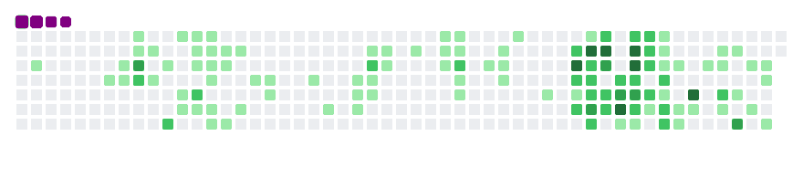

<!--<h3 align="center">Hello folks 👋, I'm Mudzia Hutama</h3>-->
<h3 align="center">A self-taught backend on Node JS.</h3>
<h4 align="center">🌱 I’m currently learning CQRS and Domain Driven Design</h4>

 
<h3 align="center">Connect with me:</h3>

 
<h3 align="center">Languages and Tools:</h3>

  
  
  
  

  
  
  
  

  
  
  
  

 

 
<!--

-->
 

<!--<picture>
  <source media="(prefers-color-scheme: dark)" srcset="github-snake-dark.gif" />
  <source media="(prefers-color-scheme: light)" srcset="github-snake.gif" />
  
</picture>-->
[![Languages and Tools](https://github-readme-tech-stack.vercel.app/api/cards?title=Languages+and+Tools&titleAlign=center&fontFamily=Inter&lineCount=3&theme=catppuccin_mocha&bg=%231e1e2e&badge=%23181825&border=%236c7086&titleColor=%2394e2d5&line1=data%3Aimage%2Fsvg%2Bxml%3Bbase64%2CPD94bWwgdmVyc2lvbj0iMS4wIiBlbmNvZGluZz0idXRmLTgiPz4NCjwhLS0gR2VuZXJhdG9yOiBBZG9iZSBJbGx1c3RyYXRvciAxOS4wLjEsIFNWRyBFeHBvcnQgUGx1Zy1JbiAuIFNWRyBWZXJzaW9uOiA2LjAwIEJ1aWxkIDApICAtLT4NCjxzdmcgdmVyc2lvbj0iMS4xIiBpZD0iTGF5ZXJfMSIgeG1sbnM9Imh0dHA6Ly93d3cudzMub3JnLzIwMDAvc3ZnIiB4bWxuczp4bGluaz0iaHR0cDovL3d3dy53My5vcmcvMTk5OS94bGluayIgeD0iMHB4IiB5PSIwcHgiDQoJIHZpZXdCb3g9IjAgMCAzMDQgMTgyIiBzdHlsZT0iZW5hYmxlLWJhY2tncm91bmQ6bmV3IDAgMCAzMDQgMTgyOyIgeG1sOnNwYWNlPSJwcmVzZXJ2ZSI%2BDQo8c3R5bGUgdHlwZT0idGV4dC9jc3MiPg0KCS5zdDB7ZmlsbDojMjUyRjNFO30NCgkuc3Qxe2ZpbGwtcnVsZTpldmVub2RkO2NsaXAtcnVsZTpldmVub2RkO2ZpbGw6I0ZGOTkwMDt9DQo8L3N0eWxlPg0KPGc%2BDQoJPHBhdGggY2xhc3M9InN0MCIgZD0iTTg2LjQsNjYuNGMwLDMuNywwLjQsNi43LDEuMSw4LjljMC44LDIuMiwxLjgsNC42LDMuMiw3LjJjMC41LDAuOCwwLjcsMS42LDAuNywyLjNjMCwxLTAuNiwyLTEuOSwzbC02LjMsNC4yDQoJCWMtMC45LDAuNi0xLjgsMC45LTIuNiwwLjljLTEsMC0yLTAuNS0zLTEuNEM3Ni4yLDkwLDc1LDg4LjQsNzQsODYuOGMtMS0xLjctMi0zLjYtMy4xLTUuOWMtNy44LDkuMi0xNy42LDEzLjgtMjkuNCwxMy44DQoJCWMtOC40LDAtMTUuMS0yLjQtMjAtNy4yYy00LjktNC44LTcuNC0xMS4yLTcuNC0xOS4yYzAtOC41LDMtMTUuNCw5LjEtMjAuNmM2LjEtNS4yLDE0LjItNy44LDI0LjUtNy44YzMuNCwwLDYuOSwwLjMsMTAuNiwwLjgNCgkJYzMuNywwLjUsNy41LDEuMywxMS41LDIuMnYtNy4zYzAtNy42LTEuNi0xMi45LTQuNy0xNmMtMy4yLTMuMS04LjYtNC42LTE2LjMtNC42Yy0zLjUsMC03LjEsMC40LTEwLjgsMS4zYy0zLjcsMC45LTcuMywyLTEwLjgsMy40DQoJCWMtMS42LDAuNy0yLjgsMS4xLTMuNSwxLjNjLTAuNywwLjItMS4yLDAuMy0xLjYsMC4zYy0xLjQsMC0yLjEtMS0yLjEtMy4xdi00LjljMC0xLjYsMC4yLTIuOCwwLjctMy41YzAuNS0wLjcsMS40LTEuNCwyLjgtMi4xDQoJCWMzLjUtMS44LDcuNy0zLjMsMTIuNi00LjVjNC45LTEuMywxMC4xLTEuOSwxNS42LTEuOWMxMS45LDAsMjAuNiwyLjcsMjYuMiw4LjFjNS41LDUuNCw4LjMsMTMuNiw4LjMsMjQuNlY2Ni40eiBNNDUuOCw4MS42DQoJCWMzLjMsMCw2LjctMC42LDEwLjMtMS44YzMuNi0xLjIsNi44LTMuNCw5LjUtNi40YzEuNi0xLjksMi44LTQsMy40LTYuNGMwLjYtMi40LDEtNS4zLDEtOC43di00LjJjLTIuOS0wLjctNi0xLjMtOS4yLTEuNw0KCQljLTMuMi0wLjQtNi4zLTAuNi05LjQtMC42Yy02LjcsMC0xMS42LDEuMy0xNC45LDRjLTMuMywyLjctNC45LDYuNS00LjksMTEuNWMwLDQuNywxLjIsOC4yLDMuNywxMC42DQoJCUMzNy43LDgwLjQsNDEuMiw4MS42LDQ1LjgsODEuNnogTTEyNi4xLDkyLjRjLTEuOCwwLTMtMC4zLTMuOC0xYy0wLjgtMC42LTEuNS0yLTIuMS0zLjlMOTYuNywxMC4yYy0wLjYtMi0wLjktMy4zLTAuOS00DQoJCWMwLTEuNiwwLjgtMi41LDIuNC0yLjVoOS44YzEuOSwwLDMuMiwwLjMsMy45LDFjMC44LDAuNiwxLjQsMiwyLDMuOWwxNi44LDY2LjJsMTUuNi02Ni4yYzAuNS0yLDEuMS0zLjMsMS45LTMuOWMwLjgtMC42LDIuMi0xLDQtMQ0KCQloOGMxLjksMCwzLjIsMC4zLDQsMWMwLjgsMC42LDEuNSwyLDEuOSwzLjlsMTUuOCw2N2wxNy4zLTY3YzAuNi0yLDEuMy0zLjMsMi0zLjljMC44LTAuNiwyLjEtMSwzLjktMWg5LjNjMS42LDAsMi41LDAuOCwyLjUsMi41DQoJCWMwLDAuNS0wLjEsMS0wLjIsMS42Yy0wLjEsMC42LTAuMywxLjQtMC43LDIuNWwtMjQuMSw3Ny4zYy0wLjYsMi0xLjMsMy4zLTIuMSwzLjljLTAuOCwwLjYtMi4xLDEtMy44LDFoLTguNmMtMS45LDAtMy4yLTAuMy00LTENCgkJYy0wLjgtMC43LTEuNS0yLTEuOS00TDE1NiwyM2wtMTUuNCw2NC40Yy0wLjUsMi0xLjEsMy4zLTEuOSw0Yy0wLjgsMC43LTIuMiwxLTQsMUgxMjYuMXogTTI1NC42LDk1LjFjLTUuMiwwLTEwLjQtMC42LTE1LjQtMS44DQoJCWMtNS0xLjItOC45LTIuNS0xMS41LTRjLTEuNi0wLjktMi43LTEuOS0zLjEtMi44Yy0wLjQtMC45LTAuNi0xLjktMC42LTIuOHYtNS4xYzAtMi4xLDAuOC0zLjEsMi4zLTMuMWMwLjYsMCwxLjIsMC4xLDEuOCwwLjMNCgkJYzAuNiwwLjIsMS41LDAuNiwyLjUsMWMzLjQsMS41LDcuMSwyLjcsMTEsMy41YzQsMC44LDcuOSwxLjIsMTEuOSwxLjJjNi4zLDAsMTEuMi0xLjEsMTQuNi0zLjNjMy40LTIuMiw1LjItNS40LDUuMi05LjUNCgkJYzAtMi44LTAuOS01LjEtMi43LTdjLTEuOC0xLjktNS4yLTMuNi0xMC4xLTUuMkwyNDYsNTJjLTcuMy0yLjMtMTIuNy01LjctMTYtMTAuMmMtMy4zLTQuNC01LTkuMy01LTE0LjVjMC00LjIsMC45LTcuOSwyLjctMTEuMQ0KCQljMS44LTMuMiw0LjItNiw3LjItOC4yYzMtMi4zLDYuNC00LDEwLjQtNS4yYzQtMS4yLDguMi0xLjcsMTIuNi0xLjdjMi4yLDAsNC41LDAuMSw2LjcsMC40YzIuMywwLjMsNC40LDAuNyw2LjUsMS4xDQoJCWMyLDAuNSwzLjksMSw1LjcsMS42YzEuOCwwLjYsMy4yLDEuMiw0LjIsMS44YzEuNCwwLjgsMi40LDEuNiwzLDIuNWMwLjYsMC44LDAuOSwxLjksMC45LDMuM3Y0LjdjMCwyLjEtMC44LDMuMi0yLjMsMy4yDQoJCWMtMC44LDAtMi4xLTAuNC0zLjgtMS4yYy01LjctMi42LTEyLjEtMy45LTE5LjItMy45Yy01LjcsMC0xMC4yLDAuOS0xMy4zLDIuOGMtMy4xLDEuOS00LjcsNC44LTQuNyw4LjljMCwyLjgsMSw1LjIsMyw3LjENCgkJYzIsMS45LDUuNywzLjgsMTEsNS41bDE0LjIsNC41YzcuMiwyLjMsMTIuNCw1LjUsMTUuNSw5LjZjMy4xLDQuMSw0LjYsOC44LDQuNiwxNGMwLDQuMy0wLjksOC4yLTIuNiwxMS42DQoJCWMtMS44LDMuNC00LjIsNi40LTcuMyw4LjhjLTMuMSwyLjUtNi44LDQuMy0xMS4xLDUuNkMyNjQuNCw5NC40LDI1OS43LDk1LjEsMjU0LjYsOTUuMXoiLz4NCgk8Zz4NCgkJPHBhdGggY2xhc3M9InN0MSIgZD0iTTI3My41LDE0My43Yy0zMi45LDI0LjMtODAuNywzNy4yLTEyMS44LDM3LjJjLTU3LjYsMC0xMDkuNS0yMS4zLTE0OC43LTU2LjdjLTMuMS0yLjgtMC4zLTYuNiwzLjQtNC40DQoJCQljNDIuNCwyNC42LDk0LjcsMzkuNSwxNDguOCwzOS41YzM2LjUsMCw3Ni42LTcuNiwxMTMuNS0yMy4yQzI3NC4yLDEzMy42LDI3OC45LDEzOS43LDI3My41LDE0My43eiIvPg0KCQk8cGF0aCBjbGFzcz0ic3QxIiBkPSJNMjg3LjIsMTI4LjFjLTQuMi01LjQtMjcuOC0yLjYtMzguNS0xLjNjLTMuMiwwLjQtMy43LTIuNC0wLjgtNC41YzE4LjgtMTMuMiw0OS43LTkuNCw1My4zLTUNCgkJCWMzLjYsNC41LTEsMzUuNC0xOC42LDUwLjJjLTIuNywyLjMtNS4zLDEuMS00LjEtMS45QzI4Mi41LDE1NS43LDI5MS40LDEzMy40LDI4Ny4yLDEyOC4xeiIvPg0KCTwvZz4NCjwvZz4NCjwvc3ZnPg0K%2CAWS%2C%3Bdata%3Aimage%2Fsvg%2Bxml%3Bbase64%2CPD94bWwgdmVyc2lvbj0iMS4wIiBlbmNvZGluZz0idXRmLTgiPz4KDTwhLS0gVXBsb2FkZWQgdG86IFNWRyBSZXBvLCB3d3cuc3ZncmVwby5jb20sIEdlbmVyYXRvcjogU1ZHIFJlcG8gTWl4ZXIgVG9vbHMgLS0%2BCjxzdmcgd2lkdGg9IjgwMHB4IiBoZWlnaHQ9IjgwMHB4IiB2aWV3Qm94PSIwIC0yMC41IDI1NiAyNTYiIHhtbG5zPSJodHRwOi8vd3d3LnczLm9yZy8yMDAwL3N2ZyI%2BCg08ZyBmaWxsPSJub25lIiBmaWxsLXJ1bGU9ImV2ZW5vZGQiPgoNPHBhdGggZD0iTTM4LjYxNyAxNzMuOTg0di0xNi4zNjJjMC0yLjE1IDEuMzQ0LTMuODc3IDMuNTctMy44NzdoLjYxNmMyLjIyNSAwIDMuNTYzIDEuNzI5IDMuNTYzIDMuODc3djM0LjQ0N2MwIDguNC00LjE1IDE1LjA4NC0xMS4zODIgMTkuMzQyYTIxLjM3NCAyMS4zNzQgMCAwIDEtMTAuOTQ1IDIuOTg1aC0xLjUzN2MtOC40MDIgMC0xNS4wNzctNC4xNTMtMTkuMzQyLTExLjM4YTIxLjMxNCAyMS4zMTQgMCAwIDEtMi45ODQtMTAuOTQ3di0xLjUzNWMwLTguNDAzIDQuMTUyLTE1LjA4MyAxMS4zNzgtMTkuMzQ5YTIxLjI5OCAyMS4yOTggMCAwIDEgMTAuOTQ4LTIuOTg1aDEuNTM3YzUuNjg2IDAgMTAuNTEgMi4yMDQgMTQuNTc4IDUuNzg0ek03LjkyNCAxOTEuM2MwIDYuMDY4IDIuOTQxIDEwLjYzIDguMjU4IDEzLjU0IDIuMTUgMS4xNzYgNC40ODQgMS44MDggNi45MzcgMS44MDggNS45NTYgMCAxMC4zNzQtMi44MSAxMy40MjEtNy44NTcgMS40MTctMi4zNDggMi4wNzctNC45MTcgMi4wNzctNy42NDggMC01LjI2LTIuNDktOS4zNjUtNi43MjktMTIuNDE0LTIuNTctMS44NDgtNS40NjMtMi43NzUtOC42MTgtMi43NzUtNi40OTIgMC0xMS4xNjQgMy4yOC0xMy45NjggOS4xMDYtLjk0NiAxLjk3LTEuMzc4IDQuMDYxLTEuMzc4IDYuMjR6bTY1LjMyNC0yMy4xaDEuMDc0YzguOTc4IDAgMTUuODA2IDQuMzU1IDIwLjEzMyAxMi4xOTIgMS43MyAzLjEzNSAyLjY1NiA2LjU1NyAyLjY1NiAxMC4xNDJ2MS41MzVjMCA4LjQtNC4xNDIgMTUuMDkzLTExLjM4NSAxOS4zNDMtMy4zNTMgMS45NjctNy4wNTcgMi45ODQtMTAuOTQzIDIuOTg0aC0xLjUzNWMtOC40MDIgMC0xNS4wNzktNC4xNTMtMTkuMzQyLTExLjM4YTIxLjMxNiAyMS4zMTYgMCAwIDEtMi45ODctMTAuOTQ3di0xLjUzNWMwLTguNDA0IDQuMTY5LTE1LjA2MiAxMS4zNzctMTkuMzQ3IDMuMzUxLTEuOTkxIDcuMDU4LTIuOTg3IDEwLjk1Mi0yLjk4N3ptLTE0LjU4IDIzLjFjMCA1Ljg5IDIuODkgMTAuMjIzIDcuODY1IDEzLjI3IDIuMzM2IDEuNDMgNC45MDkgMi4wNzggNy42MzggMi4wNzggNS44MiAwIDEwLjEyMi0yLjk1MSAxMy4xMTYtNy44NjMgMS40MjgtMi4zNDIgMi4wNzQtNC45MTUgMi4wNzQtNy42NDIgMC01LjQ3Ny0yLjYzOC05LjY2MS03LjE0OC0xMi42OTMtMi40NzEtMS42NjMtNS4yMjItMi40OTYtOC4xOTgtMi40OTYtNi40OTIgMC0xMS4xNjQgMy4yOC0xMy45NjcgOS4xMDYtLjk0OCAxLjk3LTEuMzggNC4wNjEtMS4zOCA2LjI0em03MC42NTYtMTQuNzI3Yy0xLjE3LS41NDgtMy4zNi0uNzMtNC42MjQtLjc3OC02LjQ3NC0uMjQ0LTExLjE1OCAzLjQwMi0xMy45MDYgOS4xMTMtLjk0OSAxLjk3LTEuMzgyIDQuMDU1LTEuMzgyIDYuMjM1IDAgNi42MzcgMy40ODUgMTEuMjg0IDkuNDA5IDE0LjExNyAyLjE2NCAxLjAzNCA0Ljk1OCAxLjIzIDcuMzIzIDEuMjMgMi4wOCAwIDUuMDItMS4yNzQgNi44NjYtMi4xNTFsLjMyLS4xNTJoMS40MzNsLjE1OC4wMzJjMS43NjIuMzY3IDMuMDkyIDEuNDg0IDMuMDkyIDMuMzh2Ljc2N2MwIDQuNzE4LTguNjIyIDUuNzk4LTExLjkxMiA2LjAyOC0xMS42MS44MDMtMjAuMjkzLTUuNTczLTIzLjYwMy0xNi42NDctLjU3NS0xLjkyMy0uODM0LTMuODMzLS44MzQtNS44Mzd2LTEuNTMzYzAtOC40MDMgNC4xNy0xNS4wNTkgMTEuMzc3LTE5LjM0IDMuMzUxLTEuOTkgNy4wNTctMi45OSAxMC45NS0yLjk5aDEuNTM2YzQuMTMgMCA3LjkzNCAxLjE3MyAxMS4zNDQgMy41MDJsLjI4LjE5NC4xNzcuMjkyYy4zNjguNjEuNjg1IDEuMzE2LjY4NSAyLjA0MnYuNzY3YzAgMS45NzgtMS40OCAzLjA0Mi0zLjI2NiAzLjM4NmwtLjE0OC4wMjZoLS40NThjLTEuMTU2IDAtMy43ODUtMS4xOTctNC44MTctMS42ODN6bTI1LjEzNCA1LjI0N2MzLjAxLTMuMDE0IDYuMDMtNi4wMjIgOS4wODUtOC45ODYuODUxLS44MjcgNC4wNzQtNC4zMjcgNS4zNDMtNC4zMjdoMS4zODhsLjE1OC4wMzNjMS43NjguMzY3IDMuMDkyIDEuNDg2IDMuMDkyIDMuMzg2di43NjZjMCAxLjI5Ni0xLjUxOCAyLjgwMi0yLjM1NSAzLjY4OS0xLjc4IDEuODg3LTMuNjU0IDMuNzEyLTUuNDc2IDUuNTZsLTkuMzYyIDkuNTA0YzQuMDMxIDQuMDQgOC4wNTggOC4wODMgMTIuMDU2IDEyLjE1NGEzMTMuMzA0IDMxMy4zMDQgMCAwIDEgMy4zMDEgMy4zOTZjLjM4NS40MDUuOTUzLjkwOSAxLjI3NiAxLjQ3LjM0Ny41MjYuNTYgMS4xMTkuNTYgMS43NTJ2LjhsLS4wNDUuMTg1Yy0uNDM1IDEuNzY4LTEuNTU3IDMuMTk0LTMuNTE2IDMuMTk0aC0uNjE3Yy0xLjI4MiAwLTIuNzMtMS40NS0zLjYwOC0yLjI3OS0xLjgxLTEuNzA2LTMuNTU3LTMuNS01LjMzMS01LjI0M2wtNS45NDktNS44NHY5LjMzNGMwIDIuMTUtMS4zNDYgMy44NzgtMy41NjkgMy44NzhoLS42MWMtMi4yMjYgMC0zLjU3LTEuNzI4LTMuNTctMy44Nzh2LTUyLjU5NmMwLTIuMTUgMS4zNDUtMy44NyAzLjU3LTMuODdoLjYxYzIuMjIzIDAgMy41NjkgMS43MiAzLjU2OSAzLjg3djI0LjA0OHptOTYuNTc3LTEzLjMxM2guNzdjMi4zMjQgMCAzLjg3NSAxLjU2NiAzLjg3NSAzLjg3NyAwIDMuMjA4LTMuMDY3IDQuMDI5LTUuNzIgNC4wMjktMy40OCAwLTYuODAzIDIuMTA3LTkuMjAyIDQuNDctMi45OTEgMi45NDktNC4zIDYuNzI2LTQuMyAxMC44Nzh2MTguNzU5YzAgMi4xNS0xLjM0MyAzLjg3Ni0zLjU3IDMuODc2aC0uNjEyYy0yLjIyNyAwLTMuNTY5LTEuNzI1LTMuNTY5LTMuODc2di0xOS44MzZjMC03LjYxNyAzLjcwOC0xMy44MzUgOS44OS0xOC4xOTYgMy42OTEtMi42MDUgNy45MTktMy45OCAxMi40MzgtMy45OHptLTU1LjA3NCAzNy4xNzZjMi44Mi45ODUgNi4wMzUuODQ0IDguOTI4LjM0IDEuNDgtLjYyOSA1LjI2NC0yLjI4IDYuNjU2LTIuMDM4bC4yMTcuMDM3LjIuMDk4Yy44NS40MTIgMS42NjEuOTk1IDIuMDk1IDEuODYgMS4wMTQgMi4wMjcuNTI3IDQuMDY1LTEuNDY1IDUuMjE2bC0uNjYzLjM4M2MtNy4zNSA0LjI0Mi0xNS4xNjggMy42NTQtMjIuNDk1LS4zMDgtMy41MDMtMS44OTQtNi4xODMtNC43MDUtOC4xNi04LjEzMmwtLjQ2Mi0uODAxYy00LjcxOS04LjE3Mi00LjA4Mi0xNi43NjggMS4yNC0yNC41MzkgMS44MzctMi42ODYgNC4yMzgtNC43NjEgNy4wNDUtNi4zODRsMS4wNjItLjYxM2M2LjkyMi0zLjk5NiAxNC4zNDEtMy43MjIgMjEuNDUtLjIxNSAzLjgyMyAxLjg4NiA2LjkyIDQuNjk3IDkuMDU0IDguMzk0bC4zODQuNjY2YzEuNTUgMi42ODYtLjQ1OCA1LjAyNi0yLjUzMSA2LjYyNi0yLjQwNiAxLjg1Ni00LjgzNSA0LjA5LTcuMTQxIDYuMDgtNS4xNDIgNC40MzktMTAuMjc2IDguODg4LTE1LjQxNCAxMy4zM3ptLTYuNjU1LTQuNjc0YzUuNzUtNC45MyAxMS41MDItOS44NjUgMTcuMjM3LTE0LjgxNiAxLjk2LTEuNjkgNC4xMDktMy40NDQgNi4wNTMtNS4yMjEtMS41Ni0xLjk2Ni00LjE2Ni0zLjM4My02LjM4LTQuMjI4LTQuNDctMS43MDMtOC44NzctMS4xMzEtMTIuOTc2IDEuMjM1LTUuMzY1IDMuMDk4LTcuNjUgOC4wMzEtNy40NSAxNC4xNy4wOCAyLjQxOC43MyA0Ljc0OCAyLjAxMyA2LjgwNS40NTIuNzI1Ljk1NyAxLjQwNiAxLjUwMyAyLjA1NXpNMTQ3LjQ4OCA0NS43MzJoMjIuODY2djIzLjM3NWgxMS41NjFjNS4zNCAwIDEwLjgzMS0uOTUxIDE1Ljg4Ny0yLjY2NCAyLjQ4NS0uODQzIDUuMjczLTIuMDE1IDcuNzI0LTMuNDktMy4yMjgtNC4yMTQtNC44NzYtOS41MzUtNS4zNi0xNC43OC0uNjYtNy4xMzUuNzgtMTYuNDIxIDUuNjA4LTIyLjAwNWwyLjQwNC0yLjc4IDIuODY0IDIuMzAzYzcuMjExIDUuNzkzIDEzLjI3NiAxMy44ODkgMTQuMzQ1IDIzLjExOCA4LjY4My0yLjU1NCAxOC44NzgtMS45NSAyNi41MzEgMi40NjdsMy4xNCAxLjgxMi0xLjY1MiAzLjIyNkMyNDYuOTMzIDY4Ljk0NiAyMzMuNCA3Mi44NiAyMjAuMTcgNzIuMTY3Yy0xOS43OTcgNDkuMzA5LTYyLjg5OCA3Mi42NTMtMTE1LjE1NyA3Mi42NTMtMjcgMC01MS43Ny0xMC4wOTMtNjUuODc2LTM0LjA0N2wtLjIzMS0uMzktMi4wNTUtNC4xODJjLTQuNzY4LTEwLjU0NC02LjM1Mi0yMi4wOTUtNS4yNzgtMzMuNjM3bC4zMjMtMy40NTdINTEuNDVWNDUuNzMyaDIyLjg2NVYyMi44NjZoNDUuNzMzVjBoMjcuNDR2NDUuNzMyIiBmaWxsPSIjMzY0NTQ4Ii8%2BCg08cGF0aCBkPSJNMjIxLjU3IDU0LjM4YzEuNTMzLTExLjkxNi03LjM4NC0yMS4yNzUtMTIuOTE0LTI1LjcxOS02LjM3MyA3LjM2OC03LjM2MyAyNi42NzggMi42MzUgMzQuODA4LTUuNTggNC45NTYtMTcuMzM3IDkuNDQ4LTI5LjM3NiA5LjQ0OEgzNS4zN2MtMS4xNyAxMi41NjcgMS4wMzYgMjQuMTQgNi4wNzUgMzQuMDQ1bDEuNjY3IDMuMDVhNTYuNTM2IDU2LjUzNiAwIDAgMCAzLjQ1NSA1LjE4NGM2LjAyNS4zODcgMTEuNTguNTIgMTYuNjYyLjQwOGguMDAyYzkuOTg3LS4yMiAxOC4xMzYtMS40IDI0LjMxMi0zLjU0YTEuNzYxIDEuNzYxIDAgMCAxIDEuMTUzIDMuMzI2Yy0uODIyLjI4Ni0xLjY3OC41NTItMi41NjIuODA1aC0uMDAzYy00Ljg2MyAxLjM4OS0xMC4wNzggMi4zMjMtMTYuODA2IDIuNzM4LjQuMDA3LS40MTYuMDYtLjQxOC4wNi0uMjI5LjAxNS0uNTE3LjA0OC0uNzQ3LjA2LTIuNjQ4LjE0OS01LjUwNi4xOC04LjQyOC4xOC0zLjE5NiAwLTYuMzQzLS4wNi05Ljg2Mi0uMjRsLS4wOS4wNmMxMi4yMSAxMy43MjQgMzEuMzAyIDIxLjk1NSA1NS4yMzQgMjEuOTU1IDUwLjY0OCAwIDkzLjYwOC0yMi40NTIgMTEyLjYzMi03Mi44NTcgMTMuNDk2IDEuMzg1IDI2LjQ2Ny0yLjA1NyAzMi4zNjctMTMuNTc1LTkuMzk4LTUuNDIzLTIxLjQ4NC0zLjY5NC0yOC40NDMtLjE5NiIgZmlsbD0iIzIyQTBDOCIvPgoNPHBhdGggZD0iTTIyMS41NyA1NC4zOGMxLjUzMy0xMS45MTYtNy4zODQtMjEuMjc1LTEyLjkxNC0yNS43MTktNi4zNzMgNy4zNjgtNy4zNjMgMjYuNjc4IDIuNjM1IDM0LjgwOC01LjU4IDQuOTU2LTE3LjMzNyA5LjQ0OC0yOS4zNzYgOS40NDhINDQuMDQ4Yy0uNTk4IDE5LjI0NiA2LjU0NCAzMy44NTUgMTkuMTggNDIuNjg3aC4wMDNjOS45ODctLjIyIDE4LjEzNi0xLjQgMjQuMzEyLTMuNTRhMS43NjEgMS43NjEgMCAwIDEgMS4xNTMgMy4zMjZjLS44MjIuMjg2LTEuNjc4LjU1Mi0yLjU2Mi44MDVoLS4wMDNjLTQuODYzIDEuMzg5LTEwLjUyNiAyLjQ0My0xNy4yNTQgMi44NTgtLjAwMiAwLS4xNjMtLjE1NS0uMTY1LS4xNTUgMTcuMjM3IDguODQyIDQyLjIzIDguODEgNzAuODg1LTIuMTk3IDMyLjEzLTEyLjM0NCA2Mi4wMjktMzUuODYgODIuODktNjIuNzU3LS4zMTQuMTQyLS42Mi4yODctLjkxNy40MzYiIGZpbGw9IiMzN0IxRDkiLz4KDTxwYXRoIGQ9Ik0zNS42NDUgODguMTg2Yy45MSA2LjczMiAyLjg4IDEzLjAzNSA1LjggMTguNzc2bDEuNjY3IDMuMDVhNTYuNDMyIDU2LjQzMiAwIDAgMCAzLjQ1NSA1LjE4NGM2LjAyNi4zODcgMTEuNTgxLjUyIDE2LjY2NC40MDggOS45ODctLjIyIDE4LjEzNi0xLjQgMjQuMzEyLTMuNTRhMS43NjEgMS43NjEgMCAwIDEgMS4xNTMgMy4zMjZjLS44MjIuMjg2LTEuNjc4LjU1Mi0yLjU2Mi44MDVoLS4wMDNjLTQuODYzIDEuMzg5LTEwLjQ5NiAyLjM4My0xNy4yMjQgMi43OTktLjIzMS4wMTQtLjYzNC4wMTctLjg2Ny4wMy0yLjY0Ni4xNDgtNS40NzUuMjM5LTguMzk4LjIzOS0zLjE5NSAwLTYuNDYzLS4wNjEtOS45OC0uMjQgMTIuMjEgMTMuNzI0IDMxLjQyIDIxLjk4NSA1NS4zNTIgMjEuOTg1IDQzLjM2IDAgODEuMDg0LTE2LjQ1OCAxMDIuOTc5LTUyLjgyMkgzNS42NDUiIGZpbGw9IiMxQjgxQTUiLz4KDTxwYXRoIGQ9Ik00NS4zNjcgODguMTg2YzIuNTkyIDExLjgyIDguODIxIDIxLjA5OSAxNy44NjQgMjcuNDE4IDkuOTg3LS4yMiAxOC4xMzYtMS40IDI0LjMxMi0zLjU0YTEuNzYxIDEuNzYxIDAgMCAxIDEuMTUzIDMuMzI2Yy0uODIyLjI4Ni0xLjY3OC41NTItMi41NjIuODA1aC0uMDAzYy00Ljg2MyAxLjM4OS0xMC42MTUgMi4zODMtMTcuMzQ0IDIuNzk5IDE3LjIzNiA4Ljg0IDQyLjE1NyA4LjcxMyA3MC44MS0yLjI5MyAxNy4zMzQtNi42NiAzNC4wMTctMTYuNTc0IDQ4Ljk4NC0yOC41MTVINDUuMzY3IiBmaWxsPSIjMUQ5MUI0Ii8%2BCg08cGF0aCBkPSJNNTUuMjYgNDkuNTQzaDE5LjgxOHYxOS44MThINTUuMjZWNDkuNTQzem0xLjY1MSAxLjY1MmgxLjU2NFY2Ny43MWgtMS41NjRWNTEuMTk1em0yLjk0IDBoMS42MjdWNjcuNzFoLTEuNjI2VjUxLjE5NXptMy4wMDIgMGgxLjYyN1Y2Ny43MWgtMS42MjdWNTEuMTk1em0zLjAwNCAwaDEuNjI2VjY3LjcxaC0xLjYyNlY1MS4xOTV6bTMuMDAzIDBoMS42MjZWNjcuNzFINjguODZWNTEuMTk1em0zLjAwMiAwaDEuNTY1VjY3LjcxaC0xLjU2NVY1MS4xOTV6TTc4LjEyNiAyNi42NzdoMTkuODE5djE5LjgxN2gtMTkuODJWMjYuNjc3em0xLjY1MiAxLjY1MmgxLjU2M3YxNi41MTRoLTEuNTYzVjI4LjMyOXptMi45NCAwaDEuNjI2djE2LjUxNGgtMS42MjVWMjguMzI5em0zLjAwMiAwaDEuNjI2djE2LjUxNEg4NS43MlYyOC4zMjl6bTMuMDAzIDBoMS42MjZ2MTYuNTE0aC0xLjYyNlYyOC4zMjl6bTMuMDAzIDBoMS42Mjd2MTYuNTE0aC0xLjYyN1YyOC4zMjl6bTMuMDAyIDBoMS41NjZ2MTYuNTE0aC0xLjU2NlYyOC4zMjl6IiBmaWxsPSIjMjNBM0MyIi8%2BCg08cGF0aCBkPSJNNzguMTI2IDQ5LjU0M2gxOS44MTl2MTkuODE4aC0xOS44MlY0OS41NDN6bTEuNjUyIDEuNjUyaDEuNTYzVjY3LjcxaC0xLjU2M1Y1MS4xOTV6bTIuOTQgMGgxLjYyNlY2Ny43MWgtMS42MjVWNTEuMTk1em0zLjAwMiAwaDEuNjI2VjY3LjcxSDg1LjcyVjUxLjE5NXptMy4wMDMgMGgxLjYyNlY2Ny43MWgtMS42MjZWNTEuMTk1em0zLjAwMyAwaDEuNjI3VjY3LjcxaC0xLjYyN1Y1MS4xOTV6bTMuMDAyIDBoMS41NjZWNjcuNzFoLTEuNTY2VjUxLjE5NXoiIGZpbGw9IiMzNEJCREUiLz4KDTxwYXRoIGQ9Ik0xMDAuOTkzIDQ5LjU0M2gxOS44MTh2MTkuODE4aC0xOS44MThWNDkuNTQzem0xLjY1MSAxLjY1MmgxLjU2M1Y2Ny43MWgtMS41NjNWNTEuMTk1em0yLjk0IDBoMS42MjZWNjcuNzFoLTEuNjI2VjUxLjE5NXptMy4wMDMgMGgxLjYyNlY2Ny43MWgtMS42MjZWNTEuMTk1em0zLjAwMyAwaDEuNjI2VjY3LjcxaC0xLjYyNlY1MS4xOTV6bTMuMDAyIDBoMS42MjhWNjcuNzFoLTEuNjI4VjUxLjE5NXptMy4wMDMgMGgxLjU2NFY2Ny43MWgtMS41NjRWNTEuMTk1eiIgZmlsbD0iIzIzQTNDMiIvPgoNPHBhdGggZD0iTTEwMC45OTMgMjYuNjc3aDE5LjgxOHYxOS44MTdoLTE5LjgxOFYyNi42Nzd6bTEuNjUxIDEuNjUyaDEuNTYzdjE2LjUxNGgtMS41NjNWMjguMzI5em0yLjk0IDBoMS42MjZ2MTYuNTE0aC0xLjYyNlYyOC4zMjl6bTMuMDAzIDBoMS42MjZ2MTYuNTE0aC0xLjYyNlYyOC4zMjl6bTMuMDAzIDBoMS42MjZ2MTYuNTE0aC0xLjYyNlYyOC4zMjl6bTMuMDAyIDBoMS42Mjh2MTYuNTE0aC0xLjYyOFYyOC4zMjl6bTMuMDAzIDBoMS41NjR2MTYuNTE0aC0xLjU2NFYyOC4zMjl6TTEyMy44NTkgNDkuNTQzaDE5LjgxOHYxOS44MThoLTE5LjgxOFY0OS41NDN6bTEuNjUyIDEuNjUyaDEuNTYzVjY3LjcxaC0xLjU2M1Y1MS4xOTV6bTIuOTQgMGgxLjYyNlY2Ny43MWgtMS42MjZWNTEuMTk1em0zLjAwMiAwaDEuNjI2VjY3LjcxaC0xLjYyNlY1MS4xOTV6bTMuMDAzIDBoMS42MjdWNjcuNzFoLTEuNjI3VjUxLjE5NXptMy4wMDMgMGgxLjYyN1Y2Ny43MWgtMS42MjdWNTEuMTk1em0zLjAwMyAwaDEuNTY0VjY3LjcxaC0xLjU2NFY1MS4xOTV6IiBmaWxsPSIjMzRCQkRFIi8%2BCg08cGF0aCBkPSJNMTIzLjg1OSAyNi42NzdoMTkuODE4djE5LjgxN2gtMTkuODE4VjI2LjY3N3ptMS42NTIgMS42NTJoMS41NjN2MTYuNTE0aC0xLjU2M1YyOC4zMjl6bTIuOTQgMGgxLjYyNnYxNi41MTRoLTEuNjI2VjI4LjMyOXptMy4wMDIgMGgxLjYyNnYxNi41MTRoLTEuNjI2VjI4LjMyOXptMy4wMDMgMGgxLjYyN3YxNi41MTRoLTEuNjI3VjI4LjMyOXptMy4wMDMgMGgxLjYyN3YxNi41MTRoLTEuNjI3VjI4LjMyOXptMy4wMDMgMGgxLjU2NHYxNi41MTRoLTEuNTY0VjI4LjMyOXoiIGZpbGw9IiMyM0EzQzIiLz4KDTxwYXRoIGQ9Ik0xMjMuODU5IDMuODFoMTkuODE4VjIzLjYzaC0xOS44MThWMy44MXptMS42NTIgMS42NTFoMS41NjN2MTYuNTE2aC0xLjU2M1Y1LjQ2em0yLjk0IDBoMS42MjZ2MTYuNTE2aC0xLjYyNlY1LjQ2em0zLjAwMiAwaDEuNjI2djE2LjUxNmgtMS42MjZWNS40NnptMy4wMDMgMGgxLjYyN3YxNi41MTZoLTEuNjI3VjUuNDZ6bTMuMDAzIDBoMS42Mjd2MTYuNTE2aC0xLjYyN1Y1LjQ2em0zLjAwMyAwaDEuNTY0djE2LjUxNmgtMS41NjRWNS40NnoiIGZpbGw9IiMzNEJCREUiLz4KDTxwYXRoIGQ9Ik0xNDYuNzI1IDQ5LjU0M2gxOS44MTh2MTkuODE4aC0xOS44MThWNDkuNTQzem0xLjY1IDEuNjUyaDEuNTY1VjY3LjcxaC0xLjU2NFY1MS4xOTV6bTIuOTQgMGgxLjYyN1Y2Ny43MWgtMS42MjZWNTEuMTk1em0zLjAwNCAwaDEuNjI3VjY3LjcxaC0xLjYyN1Y1MS4xOTV6bTMuMDAyIDBoMS42MjdWNjcuNzFoLTEuNjI3VjUxLjE5NXptMy4wMDQgMGgxLjYyNlY2Ny43MWgtMS42MjZWNTEuMTk1em0zLjAwMiAwaDEuNTY0VjY3LjcxaC0xLjU2NFY1MS4xOTV6IiBmaWxsPSIjMjNBM0MyIi8%2BCg08cGF0aCBkPSJNOTYuNzA0IDEwMS40OTJhNS40NjggNS40NjggMCAxIDEtLjAwMiAxMC45MzUgNS40NjggNS40NjggMCAwIDEgLjAwMi0xMC45MzUiIGZpbGw9IiNEM0VDRUMiLz4KDTxwYXRoIGQ9Ik05Ni43MDQgMTAzLjA0M2MuNSAwIC45NzcuMDk0IDEuNDE3LjI2NWExLjU5OCAxLjU5OCAwIDAgMCAuNzk4IDIuOThjLjYwNSAwIDEuMTMtLjMzNSAxLjQwMi0uODMxYTMuOTE1IDMuOTE1IDAgMSAxLTMuNjE3LTIuNDE0TTAgOTAuMTYyaDI1NC4zMjdjLTUuNTM3LTEuNDA0LTE3LjUyLTMuMzAyLTE1LjU0NC0xMC41Ni0xMC4wNyAxMS42NTItMzQuMzUzIDguMTc1LTQwLjQ4MiAyLjQzLTYuODI0IDkuODk4LTQ2LjU1NCA2LjEzNS00OS4zMjUtMS41NzYtOC41NTYgMTAuMDQxLTM1LjA2NyAxMC4wNDEtNDMuNjIzIDAtMi43NzMgNy43MTEtNDIuNTAyIDExLjQ3NC00OS4zMjcgMS41NzUtNi4xMjggNS43NDYtMzAuNDEgOS4yMjMtNDAuNDgtMi40MjhDMTcuNTIyIDg2Ljg2IDUuNTM5IDg4Ljc1OCAwIDkwLjE2MyIgZmlsbD0iIzM2NDU0OCIvPgoNPHBhdGggZD0iTTExMS4yMzcgMTQwLjg5Yy0xMy41NC02LjQyNS0yMC45NzEtMTUuMTYtMjUuMTA2LTI0LjY5NC01LjAzIDEuNDM1LTExLjA3NSAyLjM1My0xOC4xIDIuNzQ3LTIuNjQ2LjE0OC01LjQzLjIyNC04LjM1LjIyNC0zLjM2OCAwLTYuOTE3LS4xLTEwLjY0My0uMjk3IDEyLjQxNyAxMi40MSAyNy42OTIgMjEuOTY0IDU1Ljk3NiAyMi4xMzggMi4wODggMCA0LjE2LS4wNCA2LjIyMy0uMTE4IiBmaWxsPSIjQkREOUQ3Ii8%2BCg08cGF0aCBkPSJNOTEuMTYgMTI0Ljk5NGMtMS44NzMtMi41NDMtMy42OS01LjczOS01LjAyNi04LjgtNS4wMyAxLjQzNy0xMS4wNzcgMi4zNTUtMTguMTAzIDIuNzUgNC44MjYgMi42MTkgMTEuNzI3IDUuMDQ2IDIzLjEzIDYuMDUiIGZpbGw9IiNEM0VDRUMiLz4KDTwvZz4KDTwvc3ZnPg%3D%3D%2CDocker%2C%3Bdata%3Aimage%2Fsvg%2Bxml%3Bbase64%2CPD94bWwgdmVyc2lvbj0iMS4wIj8%2BDQo8IURPQ1RZUEUgc3ZnIFBVQkxJQyAiLS8vVzNDLy9EVEQgU1ZHIDEuMS8vRU4iDQogICJodHRwOi8vd3d3LnczLm9yZy9HcmFwaGljcy9TVkcvMS4xL0RURC9zdmcxMS5kdGQiPg0KDQo8c3ZnIHdpZHRoPSI0MzIuMDcxcHQiIGhlaWdodD0iNDQ1LjM4M3B0IiB2aWV3Qm94PSIwIDAgNDMyLjA3MSA0NDUuMzgzIiB4bWw6c3BhY2U9InByZXNlcnZlIiB4bWxucz0iaHR0cDovL3d3dy53My5vcmcvMjAwMC9zdmciPg0KPGcgaWQ9Im9yZ2luYWwiIHN0eWxlPSJmaWxsLXJ1bGU6bm9uemVybztjbGlwLXJ1bGU6bm9uemVybztzdHJva2U6IzAwMDAwMDtzdHJva2UtbWl0ZXJsaW1pdDo0OyI%2BDQoJPC9nPg0KPGcgaWQ9IkxheWVyX3gwMDIwXzMiIHN0eWxlPSJmaWxsLXJ1bGU6bm9uemVybztjbGlwLXJ1bGU6bm9uemVybztmaWxsOm5vbmU7c3Ryb2tlOiNGRkZGRkY7c3Ryb2tlLXdpZHRoOjEyLjQ2NTE7c3Ryb2tlLWxpbmVjYXA6cm91bmQ7c3Ryb2tlLWxpbmVqb2luOnJvdW5kO3N0cm9rZS1taXRlcmxpbWl0OjQ7Ij4NCjxwYXRoIHN0eWxlPSJmaWxsOiMwMDAwMDA7c3Ryb2tlOiMwMDAwMDA7c3Ryb2tlLXdpZHRoOjM3LjM5NTM7c3Ryb2tlLWxpbmVjYXA6YnV0dDtzdHJva2UtbGluZWpvaW46bWl0ZXI7IiBkPSJNMzIzLjIwNSwzMjQuMjI3YzIuODMzLTIzLjYwMSwxLjk4NC0yNy4wNjIsMTkuNTYzLTIzLjIzOWw0LjQ2MywwLjM5MmMxMy41MTcsMC42MTUsMzEuMTk5LTIuMTc0LDQxLjU4Ny03YzIyLjM2Mi0xMC4zNzYsMzUuNjIyLTI3LjcsMTMuNTcyLTIzLjE0OGMtNTAuMjk3LDEwLjM3Ni01My43NTUtNi42NTUtNTMuNzU1LTYuNjU1YzUzLjExMS03OC44MDMsNzUuMzEzLTE3OC44MzYsNTYuMTQ5LTIwMy4zMjIgICAgQzM1Mi41MTQtNS41MzQsMjYyLjAzNiwyNi4wNDksMjYwLjUyMiwyNi44NjlsLTAuNDgyLDAuMDg5Yy05LjkzOC0yLjA2Mi0yMS4wNi0zLjI5NC0zMy41NTQtMy40OTZjLTIyLjc2MS0wLjM3NC00MC4wMzIsNS45NjctNTMuMTMzLDE1LjkwNGMwLDAtMTYxLjQwOC02Ni40OTgtMTUzLjg5OSw4My42MjhjMS41OTcsMzEuOTM2LDQ1Ljc3NywyNDEuNjU1LDk4LjQ3LDE3OC4zMSAgICBjMTkuMjU5LTIzLjE2MywzNy44NzEtNDIuNzQ4LDM3Ljg3MS00Mi43NDhjOS4yNDIsNi4xNCwyMC4zMDcsOS4yNzIsMzEuOTEyLDguMTQ3bDAuODk3LTAuNzY1Yy0wLjI4MSwyLjg3Ni0wLjE1Nyw1LjY4OSwwLjM1OSw5LjAxOWMtMTMuNTcyLDE1LjE2Ny05LjU4NCwxNy44My0zNi43MjMsMjMuNDE2Yy0yNy40NTcsNS42NTktMTEuMzI2LDE1LjczNC0wLjc5NywxOC4zNjdjMTIuNzY4LDMuMTkzLDQyLjMwNSw3LjcxNiw2Mi4yNjgtMjAuMjI0ICAgIGwtMC43OTUsMy4xODhjNS4zMjUsNC4yNiw0Ljk2NSwzMC42MTksNS43Miw0OS40NTJjMC43NTYsMTguODM0LDIuMDE3LDM2LjQwOSw1Ljg1Niw0Ni43NzFjMy44MzksMTAuMzYsOC4zNjksMzcuMDUsNDQuMDM2LDI5LjQwNmMyOS44MDktNi4zODgsNTIuNi0xNS41ODIsNTQuNjc3LTEwMS4xMDciLz4NCjxwYXRoIHN0eWxlPSJmaWxsOiMzMzY3OTE7c3Ryb2tlOm5vbmU7IiBkPSJNNDAyLjM5NSwyNzEuMjNjLTUwLjMwMiwxMC4zNzYtNTMuNzYtNi42NTUtNTMuNzYtNi42NTVjNTMuMTExLTc4LjgwOCw3NS4zMTMtMTc4Ljg0Myw1Ni4xNTMtMjAzLjMyNmMtNTIuMjctNjYuNzg1LTE0Mi43NTItMzUuMi0xNDQuMjYyLTM0LjM4bC0wLjQ4NiwwLjA4N2MtOS45MzgtMi4wNjMtMjEuMDYtMy4yOTItMzMuNTYtMy40OTZjLTIyLjc2MS0wLjM3My00MC4wMjYsNS45NjctNTMuMTI3LDE1LjkwMiAgICBjMCwwLTE2MS40MTEtNjYuNDk1LTE1My45MDQsODMuNjNjMS41OTcsMzEuOTM4LDQ1Ljc3NiwyNDEuNjU3LDk4LjQ3MSwxNzguMzEyYzE5LjI2LTIzLjE2MywzNy44NjktNDIuNzQ4LDM3Ljg2OS00Mi43NDhjOS4yNDMsNi4xNCwyMC4zMDgsOS4yNzIsMzEuOTA4LDguMTQ3bDAuOTAxLTAuNzY1Yy0wLjI4LDIuODc2LTAuMTUyLDUuNjg5LDAuMzYxLDkuMDE5Yy0xMy41NzUsMTUuMTY3LTkuNTg2LDE3LjgzLTM2LjcyMywyMy40MTYgICAgYy0yNy40NTksNS42NTktMTEuMzI4LDE1LjczNC0wLjc5NiwxOC4zNjdjMTIuNzY4LDMuMTkzLDQyLjMwNyw3LjcxNiw2Mi4yNjYtMjAuMjI0bC0wLjc5NiwzLjE4OGM1LjMxOSw0LjI2LDkuMDU0LDI3LjcxMSw4LjQyOCw0OC45NjljLTAuNjI2LDIxLjI1OS0xLjA0NCwzNS44NTQsMy4xNDcsNDcuMjU0YzQuMTkxLDExLjQsOC4zNjgsMzcuMDUsNDQuMDQyLDI5LjQwNmMyOS44MDktNi4zODgsNDUuMjU2LTIyLjk0Miw0Ny40MDUtNTAuNTU1ICAgIGMxLjUyNS0xOS42MzEsNC45NzYtMTYuNzI5LDUuMTk0LTM0LjI4bDIuNzY4LTguMzA5YzMuMTkyLTI2LjYxMSwwLjUwNy0zNS4xOTYsMTguODcyLTMxLjIwM2w0LjQ2MywwLjM5MmMxMy41MTcsMC42MTUsMzEuMjA4LTIuMTc0LDQxLjU5MS03YzIyLjM1OC0xMC4zNzYsMzUuNjE4LTI3LjcsMTMuNTczLTIzLjE0OHoiLz4NCjxwYXRoIGQ9Ik0yMTUuODY2LDI4Ni40ODRjLTEuMzg1LDQ5LjUxNiwwLjM0OCw5OS4zNzcsNS4xOTMsMTExLjQ5NWM0Ljg0OCwxMi4xMTgsMTUuMjIzLDM1LjY4OCw1MC45LDI4LjA0NWMyOS44MDYtNi4zOSw0MC42NTEtMTguNzU2LDQ1LjM1Ny00Ni4wNTFjMy40NjYtMjAuMDgyLDEwLjE0OC03NS44NTQsMTEuMDA1LTg3LjI4MSIvPg0KPHBhdGggZD0iTTE3My4xMDQsMzguMjU2YzAsMC0xNjEuNTIxLTY2LjAxNi0xNTQuMDEyLDg0LjEwOWMxLjU5NywzMS45MzgsNDUuNzc5LDI0MS42NjQsOTguNDczLDE3OC4zMTZjMTkuMjU2LTIzLjE2NiwzNi42NzEtNDEuMzM1LDM2LjY3MS00MS4zMzUiLz4NCjxwYXRoIGQ9Ik0yNjAuMzQ5LDI2LjIwN2MtNS41OTEsMS43NTMsODkuODQ4LTM0Ljg4OSwxNDQuMDg3LDM0LjQxN2MxOS4xNTksMjQuNDg0LTMuMDQzLDEyNC41MTktNTYuMTUzLDIwMy4zMjkiLz4NCjxwYXRoIHN0eWxlPSJzdHJva2UtbGluZWpvaW46YmV2ZWw7IiBkPSJNMzQ4LjI4MiwyNjMuOTUzYzAsMCwzLjQ2MSwxNy4wMzYsNTMuNzY0LDYuNjUzYzIyLjA0LTQuNTUyLDguNzc2LDEyLjc3NC0xMy41NzcsMjMuMTU1Yy0xOC4zNDUsOC41MTQtNTkuNDc0LDEwLjY5Ni02MC4xNDYtMS4wNjljLTEuNzI5LTMwLjM1NSwyMS42NDctMjEuMTMzLDE5Ljk2LTI4LjczOWMtMS41MjUtNi44NS0xMS45NzktMTMuNTczLTE4Ljg5NC0zMC4zMzggICAgYy02LjAzNy0xNC42MzMtODIuNzk2LTEyNi44NDksMjEuMjg3LTExMC4xODNjMy44MTMtMC43ODktMjcuMTQ2LTk5LjAwMi0xMjQuNTUzLTEwMC41OTljLTk3LjM4NS0xLjU5Ny05NC4xOSwxMTkuNzYyLTk0LjE5LDExOS43NjIiLz4NCjxwYXRoIGQ9Ik0xODguNjA0LDI3NC4zMzRjLTEzLjU3NywxNS4xNjYtOS41ODQsMTcuODI5LTM2LjcyMywyMy40MTdjLTI3LjQ1OSw1LjY2LTExLjMyNiwxNS43MzMtMC43OTcsMTguMzY1YzEyLjc2OCwzLjE5NSw0Mi4zMDcsNy43MTgsNjIuMjY2LTIwLjIyOWM2LjA3OC04LjUwOS0wLjAzNi0yMi4wODYtOC4zODUtMjUuNTQ3Yy00LjAzNC0xLjY3MS05LjQyOC0zLjc2NS0xNi4zNjEsMy45OTR6Ii8%2BDQo8cGF0aCBkPSJNMTg3LjcxNSwyNzQuMDY5Yy0xLjM2OC04LjkxNywyLjkzLTE5LjUyOCw3LjUzNi0zMS45NDJjNi45MjItMTguNjI2LDIyLjg5My0zNy4yNTUsMTAuMTE3LTk2LjMzOWMtOS41MjMtNDQuMDI5LTczLjM5Ni05LjE2My03My40MzYtMy4xOTNjLTAuMDM5LDUuOTY4LDIuODg5LDMwLjI2LTEuMDY3LDU4LjU0OGMtNS4xNjIsMzYuOTEzLDIzLjQ4OCw2OC4xMzIsNTYuNDc5LDY0LjkzOCIvPg0KPHBhdGggc3R5bGU9ImZpbGw6I0ZGRkZGRjtzdHJva2Utd2lkdGg6NC4xNTU7c3Ryb2tlLWxpbmVjYXA6YnV0dDtzdHJva2UtbGluZWpvaW46bWl0ZXI7IiBkPSJNMTcyLjUxNywxNDEuN2MtMC4yODgsMi4wMzksMy43MzMsNy40OCw4Ljk3Niw4LjIwN2M1LjIzNCwwLjczLDkuNzE0LTMuNTIyLDkuOTk4LTUuNTU5YzAuMjg0LTIuMDM5LTMuNzMyLTQuMjg1LTguOTc3LTUuMDE1Yy01LjIzNy0wLjczMS05LjcxOSwwLjMzMy05Ljk5NiwyLjM2N3oiLz4NCjxwYXRoIHN0eWxlPSJmaWxsOiNGRkZGRkY7c3Ryb2tlLXdpZHRoOjIuMDc3NTtzdHJva2UtbGluZWNhcDpidXR0O3N0cm9rZS1saW5lam9pbjptaXRlcjsiIGQ9Ik0zMzEuOTQxLDEzNy41NDNjMC4yODQsMi4wMzktMy43MzIsNy40OC04Ljk3Niw4LjIwN2MtNS4yMzgsMC43My05LjcxOC0zLjUyMi0xMC4wMDUtNS41NTljLTAuMjc3LTIuMDM5LDMuNzQtNC4yODUsOC45NzktNS4wMTVjNS4yMzktMC43Myw5LjcxOCwwLjMzMywxMC4wMDIsMi4zNjh6Ii8%2BDQo8cGF0aCBkPSJNMzUwLjY3NiwxMjMuNDMyYzAuODYzLDE1Ljk5NC0zLjQ0NSwyNi44ODgtMy45ODgsNDMuOTE0Yy0wLjgwNCwyNC43NDgsMTEuNzk5LDUzLjA3NC03LjE5MSw4MS40MzUiLz4NCjxwYXRoIHN0eWxlPSJzdHJva2Utd2lkdGg6MzsiIGQ9Ik0wLDYwLjIzMiIvPg0KPC9nPg0KPC9zdmc%2B%2CPostgres%2C%3Bdata%3Aimage%2Fsvg%2Bxml%3Bbase64%2CPHN2ZyBpZD0iTGF5ZXJfMSIgeG1sbnM9Imh0dHA6Ly93d3cudzMub3JnLzIwMDAvc3ZnIiB2aWV3Qm94PSIwIDAgMjAwIDMwMCIgd2lkdGg9IjE2NjciIGhlaWdodD0iMjUwMCI%2BPHN0eWxlPi5zdDB7ZmlsbDojMGFjZjgzfS5zdDF7ZmlsbDojYTI1OWZmfS5zdDJ7ZmlsbDojZjI0ZTFlfS5zdDN7ZmlsbDojZmY3MjYyfS5zdDR7ZmlsbDojMWFiY2ZlfTwvc3R5bGU%2BPHRpdGxlPkZpZ21hLmxvZ288L3RpdGxlPjxkZXNjPkNyZWF0ZWQgdXNpbmcgRmlnbWE8L2Rlc2M%2BPHBhdGggaWQ9InBhdGgwX2ZpbGwiIGNsYXNzPSJzdDAiIGQ9Ik01MCAzMDBjMjcuNiAwIDUwLTIyLjQgNTAtNTB2LTUwSDUwYy0yNy42IDAtNTAgMjIuNC01MCA1MHMyMi40IDUwIDUwIDUweiIvPjxwYXRoIGlkPSJwYXRoMV9maWxsIiBjbGFzcz0ic3QxIiBkPSJNMCAxNTBjMC0yNy42IDIyLjQtNTAgNTAtNTBoNTB2MTAwSDUwYy0yNy42IDAtNTAtMjIuNC01MC01MHoiLz48cGF0aCBpZD0icGF0aDFfZmlsbF8xXyIgY2xhc3M9InN0MiIgZD0iTTAgNTBDMCAyMi40IDIyLjQgMCA1MCAwaDUwdjEwMEg1MEMyMi40IDEwMCAwIDc3LjYgMCA1MHoiLz48cGF0aCBpZD0icGF0aDJfZmlsbCIgY2xhc3M9InN0MyIgZD0iTTEwMCAwaDUwYzI3LjYgMCA1MCAyMi40IDUwIDUwcy0yMi40IDUwLTUwIDUwaC01MFYweiIvPjxwYXRoIGlkPSJwYXRoM19maWxsIiBjbGFzcz0ic3Q0IiBkPSJNMjAwIDE1MGMwIDI3LjYtMjIuNCA1MC01MCA1MHMtNTAtMjIuNC01MC01MCAyMi40LTUwIDUwLTUwIDUwIDIyLjQgNTAgNTB6Ii8%2BPC9zdmc%2B%2CFigma%2C%3B&line2=data%3Aimage%2Fsvg%2Bxml%3Bbase64%2CPD94bWwgdmVyc2lvbj0iMS4wIiBlbmNvZGluZz0idXRmLTgiPz48IS0tIFVwbG9hZGVkIHRvOiBTVkcgUmVwbywgd3d3LnN2Z3JlcG8uY29tLCBHZW5lcmF0b3I6IFNWRyBSZXBvIE1peGVyIFRvb2xzIC0tPgo8c3ZnIHdpZHRoPSI4MDBweCIgaGVpZ2h0PSI4MDBweCIgdmlld0JveD0iMCAwIDE2IDE2IiB4bWxucz0iaHR0cDovL3d3dy53My5vcmcvMjAwMC9zdmciIGZpbGw9Im5vbmUiPjxwYXRoIGZpbGw9IiNFQTQzMzUiIGQ9Ik0xMC4zMTMgNS4zNzZsMS44ODctMS41LS4zMzItLjQxNGE1LjkzNSA1LjkzNSAwIDAwLTUuNTg2LTEuMjE3IDUuODkgNS44OSAwIDAwLTMuOTc4IDQuMDg0Yy0uMDMuMTEzLjMxMi0uMDk4LjQ2My0uMDU2bDIuNjA4LS40MjhzLjEyNy0uMTI0LjIwMS0uMjA1YzEuMTYtMS4yNjYgMy4xMjYtMS40MzIgNC40NjUtLjM1NGwuMjcyLjA5eiIvPjxwYXRoIGZpbGw9IiM0Mjg1RjQiIGQ9Ik0xMy42MzcgNi4zYTUuODM1IDUuODM1IDAgMDAtMS43Ny0yLjgzOGwtMS44MyAxLjgyYTMuMjI2IDMuMjI2IDAgMDExLjE5MyAyLjU2NHYuMzIzYy45IDAgMS42My43MjUgMS42MyAxLjYyIDAgLjg5My0uNzMgMS42MTktMS42MyAxLjYxOWwtMy4yNTctLjAwMy0uMzI1LjAzNXYyLjUwN2wuMzI1LjA1M2gzLjI1N2E0LjIzNCA0LjIzNCAwIDAwNC4wOC0yLjk2MkE0LjE5OSA0LjE5OSAwIDAwMTMuNjM2IDYuM3oiLz48cGF0aCBmaWxsPSIjMzRBODUzIiBkPSJNNC43MTEgMTMuOTk5SDcuOTd2LTIuNTk0SDQuNzFjLS4yMzIgMC0uNDYxLS4wNjYtLjY3Mi0uMTYxbC0uNDU4LjE0LTEuMzEzIDEuMjk3LS4xMTQuNDQ3YTQuMjU0IDQuMjU0IDAgMDAyLjU1Ny44N3oiLz48cGF0aCBmaWxsPSIjRkJCQzA1IiBkPSJNNC43MTEgNS41NzJBNC4yMzQgNC4yMzQgMCAwMC43MjEgOC40NGE0LjIwNiA0LjIwNiAwIDAwMS40MzMgNC42ODhsMS44OS0xLjg4NGExLjYxNyAxLjYxNyAwIDAxLjQ0LTMuMDc5IDEuNjMgMS42MyAwIDAxMS43MTQuOTM2bDEuODktMS44NzhBNC4yNCA0LjI0IDAgMDA0LjcxIDUuNTcyeiIvPjwvc3ZnPg%3D%3D%2CGCP%2C%3Bdata%3Aimage%2Fsvg%2Bxml%3Bbase64%2CPHN2ZyB4bWxucz0iaHR0cDovL3d3dy53My5vcmcvMjAwMC9zdmciIHZpZXdCb3g9IjAgMCAxMjggMTI4Ij48cGF0aCBmaWxsLXJ1bGU9ImV2ZW5vZGQiIGNsaXAtcnVsZT0iZXZlbm9kZCIgZmlsbD0iIzQzOTkzNCIgZD0iTTg4LjAzOCA0Mi44MTJjMS42MDUgNC42NDMgMi43NjEgOS4zODMgMy4xNDEgMTQuMjk2LjQ3MiA2LjA5NS4yNTYgMTIuMTQ3LTEuMDI5IDE4LjE0Mi0uMDM1LjE2NS0uMTA5LjMyLS4xNjQuNDgtLjQwMy4wMDEtLjgxNC0uMDQ5LTEuMjA4LjAxMi0zLjMyOS41MjMtNi42NTUgMS4wNjUtOS45ODEgMS42MDQtMy40MzguNTU3LTYuODgxIDEuMDkyLTEwLjMxMyAxLjY4Ny0xLjIxNi4yMS0yLjcyMS0uMDQxLTMuMjEyIDEuNjQxLS4wMTQuMDQ2LS4xNTQuMDU0LS4yMzUuMDhsLjE2Ni0xMC4wNTEtLjE2OS0yNC4yNTIgMS42MDItLjI3NWMyLjYyLS40MjkgNS4yNC0uODY0IDcuODYyLTEuMjgxIDMuMTI5LS40OTcgNi4yNjEtLjk4IDkuMzkyLTEuNDY1IDEuMzgxLS4yMTUgMi43NjQtLjQxMiA0LjE0OC0uNjE4eiIvPjxwYXRoIGZpbGwtcnVsZT0iZXZlbm9kZCIgY2xpcC1ydWxlPSJldmVub2RkIiBmaWxsPSIjNDVBNTM4IiBkPSJNNjEuNzI5IDExMC4wNTRjLTEuNjktMS40NTMtMy40MzktMi44NDItNS4wNTktNC4zNy04LjcxNy04LjIyMi0xNS4wOTMtMTcuODk5LTE4LjIzMy0yOS41NjYtLjg2NS0zLjIxMS0xLjQ0Mi02LjQ3NC0xLjYyNy05Ljc5Mi0uMTMtMi4zMjItLjMxOC00LjY2NS0uMTU0LTYuOTc1LjQzNy02LjE0NCAxLjMyNS0xMi4yMjkgMy4xMjctMTguMTQ3bC4wOTktLjEzOGMuMTc1LjIzMy40MjcuNDM5LjUxNi43MDIgMS43NTkgNS4xOCAzLjUwNSAxMC4zNjQgNS4yNDIgMTUuNTUxIDUuNDU4IDE2LjMgMTAuOTA5IDMyLjYwNCAxNi4zNzYgNDguOS4xMDcuMzE4LjM4NC41NzkuNTgzLjg2NmwtLjg3IDIuOTY5eiIvPjxwYXRoIGZpbGwtcnVsZT0iZXZlbm9kZCIgY2xpcC1ydWxlPSJldmVub2RkIiBmaWxsPSIjNDZBMDM3IiBkPSJNODguMDM4IDQyLjgxMmMtMS4zODQuMjA2LTIuNzY4LjQwMy00LjE0OS42MTYtMy4xMzEuNDg1LTYuMjYzLjk2OC05LjM5MiAxLjQ2NS0yLjYyMi40MTctNS4yNDIuODUyLTcuODYyIDEuMjgxbC0xLjYwMi4yNzUtLjAxMi0xLjA0NWMtLjA1My0uODU5LS4xNDQtMS43MTctLjE1NC0yLjU3Ni0uMDY5LTUuNDc4LS4xMTItMTAuOTU2LS4xOC0xNi40MzQtLjA0Mi0zLjQyOS0uMTA1LTYuODU3LS4xNzUtMTAuMjg1LS4wNDMtMi4xMy0uMDg5LTQuMjYxLS4xODUtNi4zODgtLjA1Mi0xLjE0My0uMjM2LTIuMjgtLjMxMS0zLjQyMy0uMDQyLS42NTcuMDE2LTEuMzE5LjAyOS0xLjk3OS44MTcgMS41ODMgMS42MTYgMy4xNzggMi40NTYgNC43NDkgMS4zMjcgMi40ODQgMy40NDEgNC4zMTQgNS4zNDQgNi4zMTEgNy41MjMgNy44OTIgMTIuODY0IDE3LjA2OCAxNi4xOTMgMjcuNDMzeiIvPjxwYXRoIGZpbGwtcnVsZT0iZXZlbm9kZCIgY2xpcC1ydWxlPSJldmVub2RkIiBmaWxsPSIjNDA5NDMzIiBkPSJNNjUuMDM2IDgwLjc1M2MuMDgxLS4wMjYuMjIyLS4wMzQuMjM1LS4wOC40OTEtMS42ODIgMS45OTYtMS40MzEgMy4yMTItMS42NDEgMy40MzItLjU5NCA2Ljg3NS0xLjEzIDEwLjMxMy0xLjY4NyAzLjMyNi0uNTM5IDYuNjUyLTEuMDgxIDkuOTgxLTEuNjA0LjM5NC0uMDYyLjgwNS0uMDExIDEuMjA4LS4wMTItLjYyMiAyLjIyLTEuMTEyIDQuNDg4LTEuOTAxIDYuNjQ3LS44OTYgMi40NDktMS45OCA0LjgzOS0zLjEzMSA3LjE4MmE0OS4xNDIgNDkuMTQyIDAgMDEtNi4zNTMgOS43NjNjLTEuOTE5IDIuMzA4LTQuMDU4IDQuNDQxLTYuMjAyIDYuNTQ4LTEuMTg1IDEuMTY1LTIuNTgyIDIuMTE0LTMuODgyIDMuMTYxbC0uMzM3LS4yMy0xLjIxNC0xLjAzOC0xLjI1Ni0yLjc1M2E0MS40MDIgNDEuNDAyIDAgMDEtMS4zOTQtOS44MzhsLjAyMy0uNTYxLjE3MS0yLjQyNmMuMDU3LS44MjguMTMzLTEuNjU1LjE2OC0yLjQ4NS4xMjktMi45ODIuMjQxLTUuOTY0LjM1OS04Ljk0NnoiLz48cGF0aCBmaWxsLXJ1bGU9ImV2ZW5vZGQiIGNsaXAtcnVsZT0iZXZlbm9kZCIgZmlsbD0iIzRGQUE0MSIgZD0iTTY1LjAzNiA4MC43NTNjLS4xMTggMi45ODItLjIzIDUuOTY0LS4zNTcgOC45NDctLjAzNS44My0uMTExIDEuNjU3LS4xNjggMi40ODVsLS43NjUuMjg5Yy0xLjY5OS01LjAwMi0zLjM5OS05Ljk1MS01LjA2Mi0xNC45MTMtMi43NS04LjIwOS01LjQ2Ny0xNi40MzEtOC4yMTMtMjQuNjQyYTQ0OTguODg3IDQ0OTguODg3IDAgMDAtNi43LTE5Ljg2N2MtLjEwNS0uMzEtLjQwNy0uNTUyLS42MTctLjgyNmw0Ljg5Ni05LjAwMmMuMTY4LjI5Mi4zOS41NjUuNDk2Ljg3OWE2MTY3LjQ3NiA2MTY3LjQ3NiAwIDAxNi43NjggMjAuMTE4YzIuOTE2IDguNzMgNS44MTQgMTcuNDY3IDguNzI4IDI2LjE5OC4xMTYuMzQ5LjMwOC42NzEuNDkxIDEuMDYybC42Ny0uNzgtLjE2NyAxMC4wNTJ6Ii8%2BPHBhdGggZmlsbC1ydWxlPSJldmVub2RkIiBjbGlwLXJ1bGU9ImV2ZW5vZGQiIGZpbGw9IiM0QUE3M0MiIGQ9Ik00My4xNTUgMzIuMjI3Yy4yMS4yNzQuNTExLjUxNi42MTcuODI2YTQ0OTguODg3IDQ0OTguODg3IDAgMDE2LjcgMTkuODY3YzIuNzQ2IDguMjExIDUuNDYzIDE2LjQzMyA4LjIxMyAyNC42NDIgMS42NjIgNC45NjEgMy4zNjIgOS45MTEgNS4wNjIgMTQuOTEzbC43NjUtLjI4OS0uMTcxIDIuNDI2LS4xNTUuNTU5Yy0uMjY2IDIuNjU2LS40OSA1LjMxOC0uODE0IDcuOTY4LS4xNjMgMS4zMjgtLjUwOSAyLjYzMi0uNzcyIDMuOTQ3LS4xOTgtLjI4Ny0uNDc2LS41NDgtLjU4My0uODY2LTUuNDY3LTE2LjI5Ny0xMC45MTgtMzIuNi0xNi4zNzYtNDguOWEzODg4Ljk3MiAzODg4Ljk3MiAwIDAwLTUuMjQyLTE1LjU1MWMtLjA4OS0uMjYzLS4zNC0uNDY5LS41MTYtLjcwMmwzLjI3Mi04Ljg0eiIvPjxwYXRoIGZpbGwtcnVsZT0iZXZlbm9kZCIgY2xpcC1ydWxlPSJldmVub2RkIiBmaWxsPSIjNTdBRTQ3IiBkPSJNNjUuMjAyIDcwLjcwMmwtLjY3Ljc4Yy0uMTgzLS4zOTEtLjM3NS0uNzE0LS40OTEtMS4wNjItMi45MTMtOC43MzEtNS44MTItMTcuNDY4LTguNzI4LTI2LjE5OGE2MTY3LjQ3NiA2MTY3LjQ3NiAwIDAwLTYuNzY4LTIwLjExOGMtLjEwNS0uMzE0LS4zMjctLjU4OC0uNDk2LS44NzlsNi4wNTUtNy45NjVjLjE5MS4yNTUuNDYzLjQ4Mi41NjIuNzY5IDEuNjgxIDQuOTIxIDMuMzQ3IDkuODQ4IDUuMDAzIDE0Ljc3OCAxLjU0NyA0LjYwNCAzLjA3MSA5LjIxNSA0LjYzNiAxMy44MTMuMTA1LjMwOC40Ny41MjYuNzE0Ljc4NmwuMDEyIDEuMDQ1Yy4wNTggOC4wODIuMTE1IDE2LjE2Ny4xNzEgMjQuMjUxeiIvPjxwYXRoIGZpbGwtcnVsZT0iZXZlbm9kZCIgY2xpcC1ydWxlPSJldmVub2RkIiBmaWxsPSIjNjBCMjRGIiBkPSJNNjUuMDIxIDQ1LjQwNGMtLjI0NC0uMjYtLjYwOS0uNDc4LS43MTQtLjc4Ni0xLjU2NS00LjU5OC0zLjA4OS05LjIwOS00LjYzNi0xMy44MTMtMS42NTYtNC45My0zLjMyMi05Ljg1Ni01LjAwMy0xNC43NzgtLjA5OS0uMjg3LS4zNzEtLjUxNC0uNTYyLS43NjkgMS45NjktMS45MjggMy44NzctMy45MjUgNS45MjUtNS43NjQgMS44MjEtMS42MzQgMy4yODUtMy4zODYgMy4zNTItNS45NjguMDAzLS4xMDcuMDU5LS4yMTQuMTQ1LS41MTRsLjUxOSAxLjMwNmMtLjAxMy42NjEtLjA3MiAxLjMyMi0uMDI5IDEuOTc5LjA3NSAxLjE0My4yNTkgMi4yOC4zMTEgMy40MjMuMDk2IDIuMTI3LjE0MiA0LjI1OC4xODUgNi4zODguMDY5IDMuNDI4LjEzMiA2Ljg1Ni4xNzUgMTAuMjg1LjA2NyA1LjQ3OC4xMTEgMTAuOTU2LjE4IDE2LjQzNC4wMDguODYxLjA5OCAxLjcxOC4xNTIgMi41Nzd6Ii8%2BPHBhdGggZmlsbC1ydWxlPSJldmVub2RkIiBjbGlwLXJ1bGU9ImV2ZW5vZGQiIGZpbGw9IiNBOUFBODgiIGQ9Ik02Mi41OTggMTA3LjA4NWMuMjYzLTEuMzE1LjYwOS0yLjYyLjc3Mi0zLjk0Ny4zMjUtMi42NDkuNTQ4LTUuMzEyLjgxNC03Ljk2OGwuMDY2LS4wMS4wNjYuMDExYTQxLjQwMiA0MS40MDIgMCAwMDEuMzk0IDkuODM4Yy0uMTc2LjIzMi0uNDI1LjQzOS0uNTE4LjcwMS0uNzI3IDIuMDUtMS40MTIgNC4xMTYtMi4xNDMgNi4xNjYtLjEuMjgtLjM3OC40OTgtLjU3NC43NDRsLS43NDctMi41NjYuODctMi45Njl6Ii8%2BPHBhdGggZmlsbC1ydWxlPSJldmVub2RkIiBjbGlwLXJ1bGU9ImV2ZW5vZGQiIGZpbGw9IiNCNkI1OTgiIGQ9Ik02Mi40NzYgMTEyLjYyMWMuMTk2LS4yNDYuNDc1LS40NjQuNTc0LS43NDQuNzMxLTIuMDUgMS40MTctNC4xMTUgMi4xNDMtNi4xNjYuMDkzLS4yNjIuMzQxLS40NjkuNTE4LS43MDFsMS4yNTUgMi43NTRjLS4yNDguMzUyLS41OS42NjktLjcyOCAxLjA2MWwtMi40MDQgNy4wNTljLS4wOTkuMjgzLS40MzcuNDgzLS42NjMuNzIybC0uNjk1LTMuOTg1eiIvPjxwYXRoIGZpbGwtcnVsZT0iZXZlbm9kZCIgY2xpcC1ydWxlPSJldmVub2RkIiBmaWxsPSIjQzJDMUE3IiBkPSJNNjMuMTcxIDExNi42MDVjLjIyNy0uMjM4LjU2NC0uNDM5LjY2My0uNzIybDIuNDA0LTcuMDU5Yy4xMzctLjM5MS40OC0uNzA5LjcyOC0xLjA2MWwxLjIxNSAxLjAzN2MtLjU4Ny41OC0uOTEzIDEuMjUtLjcxNyAyLjA5N2wtLjM2OSAxLjIwOGMtLjE2OC4yMDctLjQxMS4zODctLjQ5NC42MjQtLjgzOSAyLjQwMy0xLjY0IDQuODE5LTIuNDg1IDcuMjIyLS4xMDcuMzA1LS40MDQuNTQ0LS42MTQuODEyLS4xMDktMS4zODctLjIyLTIuNzcxLS4zMzEtNC4xNTh6Ii8%2BPHBhdGggZmlsbC1ydWxlPSJldmVub2RkIiBjbGlwLXJ1bGU9ImV2ZW5vZGQiIGZpbGw9IiNDRUNEQjciIGQ9Ik02My41MDMgMTIwLjc2M2MuMjA5LS4yNjkuNTA2LS41MDguNjE0LS44MTIuODQ1LTIuNDAyIDEuNjQ2LTQuODE4IDIuNDg1LTcuMjIyLjA4My0uMjM2LjMyNS0uNDE3LjQ5NC0uNjI0bC0uNTA5IDUuNTQ1Yy0uMTM2LjE1Ny0uMzMzLjI5NC0uMzk4LjQ3Ny0uNTc1IDEuNjE0LTEuMTE3IDMuMjQtMS42OTQgNC44NTQtLjExOS4zMzMtLjM0Ny42MjctLjUyNS45MzgtLjE1OC0uMjA3LS40NDEtLjQwNy0uNDU0LS42MjMtLjA1MS0uODQxLS4wMTYtMS42ODgtLjAxMy0yLjUzM3oiLz48cGF0aCBmaWxsLXJ1bGU9ImV2ZW5vZGQiIGNsaXAtcnVsZT0iZXZlbm9kZCIgZmlsbD0iI0RCREFDNyIgZD0iTTYzLjk2OSAxMjMuOTE5Yy4xNzgtLjMxMi40MDYtLjYwNi41MjUtLjkzOC41NzgtMS42MTMgMS4xMTktMy4yMzkgMS42OTQtNC44NTQuMDY1LS4xODMuMjYzLS4zMTkuMzk4LS40NzdsLjAxMiAzLjY0LTEuMjE4IDMuMTI0LTEuNDExLS40OTV6Ii8%2BPHBhdGggZmlsbC1ydWxlPSJldmVub2RkIiBjbGlwLXJ1bGU9ImV2ZW5vZGQiIGZpbGw9IiNFQkU5REMiIGQ9Ik02NS4zOCAxMjQuNDE1bDEuMjE4LTMuMTI0LjI1MSAzLjY5Ni0xLjQ2OS0uNTcyeiIvPjxwYXRoIGZpbGwtcnVsZT0iZXZlbm9kZCIgY2xpcC1ydWxlPSJldmVub2RkIiBmaWxsPSIjQ0VDREI3IiBkPSJNNjcuNDY0IDExMC44OThjLS4xOTYtLjg0Ny4xMjktMS41MTguNzE3LTIuMDk3bC4zMzcuMjMtMS4wNTQgMS44Njd6Ii8%2BPHBhdGggZmlsbC1ydWxlPSJldmVub2RkIiBjbGlwLXJ1bGU9ImV2ZW5vZGQiIGZpbGw9IiM0RkFBNDEiIGQ9Ik02NC4zMTYgOTUuMTcybC0uMDY2LS4wMTEtLjA2Ni4wMS4xNTUtLjU1OS0uMDIzLjU2eiIvPjwvc3ZnPg%3D%3D%2Cmongodb%2C%3Bdata%3Aimage%2Fsvg%2Bxml%3Bbase64%2CPD94bWwgdmVyc2lvbj0iMS4wIiBlbmNvZGluZz0iVVRGLTgiIHN0YW5kYWxvbmU9Im5vIj8%2BCjwhLS0gVXBsb2FkZWQgdG86IFNWRyBSZXBvLCB3d3cuc3ZncmVwby5jb20sIEdlbmVyYXRvcjogU1ZHIFJlcG8gTWl4ZXIgVG9vbHMgLS0%2BCjxzdmcgd2lkdGg9IjgwMHB4IiBoZWlnaHQ9IjgwMHB4IiB2aWV3Qm94PSItMTYuNSAwIDI4OSAyODkiIHZlcnNpb249IjEuMSIgeG1sbnM9Imh0dHA6Ly93d3cudzMub3JnLzIwMDAvc3ZnIiB4bWxuczp4bGluaz0iaHR0cDovL3d3dy53My5vcmcvMTk5OS94bGluayIgcHJlc2VydmVBc3BlY3RSYXRpbz0ieE1pZFlNaWQiPgogICAgPGc%2BCiAgICAgICAgPHBhdGggZD0iTTEyNy45OTk5OTksMjg4LjQ2Mzc3MSBDMTI0LjAyNDg0NCwyODguNDYzNzcxIDEyMC4zMTQ2OTksMjg3LjQwMzcyOCAxMTYuODY5NTY0LDI4NS41NDg2NTYgTDgxLjYyMzE4ODQsMjY0LjYxMjgzOCBDNzYuMzIyOTgsMjYxLjY5NzcyNCA3OC45NzMwODU0LDI2MC42Mzc2ODIgODAuNTYzMTQ1OCwyNjAuMTA3NjYxIEM4Ny43MTg0MjU5LDI1Ny43MjI1NyA4OS4wNDM0Nzc1LDI1Ny4xOTI1NDcgOTYuNDYzNzY4OCwyNTIuOTUyMzgxIEM5Ny4yNTg3OTc5LDI1Mi40MjIzNjEgOTguMzE4ODQwNSwyNTIuNjg3MzcyIDk5LjExMzg3MTgsMjUzLjIxNzM5MiBMMTI2LjE0NDkyNywyNjkuMzgzMDI0IEMxMjcuMjA0OTcsMjY5LjkxMzA0NSAxMjguNTMwMDIxLDI2OS45MTMwNDUgMTI5LjMyNTA1MywyNjkuMzgzMDI0IEwyMzUuMDY0MTgyLDIwOC4xNjU2MzQgQzIzNi4xMjQyMjUsMjA3LjYzNTYxMSAyMzYuNjU0MjQ1LDIwNi41NzU1NzEgMjM2LjY1NDI0NSwyMDUuMjUwNTE5IEwyMzYuNjU0MjQ1LDgzLjA4MDc0NjcgQzIzNi42NTQyNDUsODEuNzU1NjkyOSAyMzYuMTI0MjI1LDgwLjY5NTY1MjYgMjM1LjA2NDE4Miw4MC4xNjU2MzI0IEwxMjkuMzI1MDUzLDE5LjIxMzI1MDYgQzEyOC4yNjUwMSwxOC42ODMyMzA1IDEyNi45Mzk5NTksMTguNjgzMjMwNSAxMjYuMTQ0OTI3LDE5LjIxMzI1MDYgTDIwLjQwNTc5NTQsODAuMTY1NjMyNCBDMTkuMzQ1NzU1MSw4MC42OTU2NTI2IDE4LjgxNTczNDksODIuMDIwNzA0MSAxOC44MTU3MzQ5LDgzLjA4MDc0NjcgTDE4LjgxNTczNDksMjA1LjI1MDUxOSBDMTguODE1NzM0OSwyMDYuMzEwNTYgMTkuMzQ1NzU1MSwyMDcuNjM1NjExIDIwLjQwNTc5NTQsMjA4LjE2NTYzNCBMNDkuMjkxOTI0NywyMjQuODYxMjg2IEM2NC45Mjc1MzY0LDIzMi44MTE1OTUgNzQuNzMyOTE5NiwyMjMuNTM2MjM0IDc0LjczMjkxOTYsMjE0LjI2MDg3MSBMNzQuNzMyOTE5Niw5My42ODExNTkgQzc0LjczMjkxOTYsOTIuMDkxMDk4NSA3Ni4wNTc5NzExLDkwLjUwMTAzNTggNzcuOTEzMDQyOCw5MC41MDEwMzU4IEw5MS40Mjg1NzE2LDkwLjUwMTAzNTggQzkzLjAxODYzNDMsOTAuNTAxMDM1OCA5NC42MDg2OTQ4LDkxLjgyNjA4NzMgOTQuNjA4Njk0OCw5My42ODExNTkgTDk0LjYwODY5NDgsMjE0LjI2MDg3MSBDOTQuNjA4Njk0OCwyMzUuMTk2Njg5IDgzLjIxMzI1MTIsMjQ3LjM4NzE2NCA2My4zMzc0NzM3LDI0Ny4zODcxNjQgQzU3LjI0MjIzNjIsMjQ3LjM4NzE2NCA1Mi40NzIwNTAyLDI0Ny4zODcxNjQgMzguOTU2NTIxNCwyNDAuNzYxOTA2IEwxMS4xMzA0MzQ3LDIyNC44NjEyODYgQzQuMjQwMTY1ODEsMjIwLjg4NjEyOSA1LjY4NDM0MTg5ZS0xNCwyMTMuNDY1ODQgNS42ODQzNDE4OWUtMTQsMjA1LjUxNTUyOCBMNS42ODQzNDE4OWUtMTQsODMuMzQ1NzU1NyBDNS42ODQzNDE4OWUtMTQsNzUuMzk1NDQ2NSA0LjI0MDE2NTgxLDY3Ljk3NTE1NTIgMTEuMTMwNDM0Nyw2NC4wMDAwMDA2IEwxMTYuODY5NTY0LDIuNzgyNjA3NTIgQzEyMy40OTQ4MjQsLTAuOTI3NTM1ODQxIDEzMi41MDUxNzYsLTAuOTI3NTM1ODQxIDEzOS4xMzA0MzYsMi43ODI2MDc1MiBMMjQ0Ljg2OTU2NSw2NC4wMDAwMDA2IEMyNTEuNzU5ODM0LDY3Ljk3NTE1NTIgMjU2LDc1LjM5NTQ0NjUgMjU2LDgzLjM0NTc1NTcgTDI1NiwyMDUuNTE1NTI4IEMyNTYsMjEzLjQ2NTg0IDI1MS43NTk4MzQsMjIwLjg4NjEyOSAyNDQuODY5NTY1LDIyNC44NjEyODYgTDEzOS4xMzA0MzYsMjg2LjA3ODY3NiBDMTM1LjY4NTI5OSwyODcuNjY4NzM5IDEzMS43MTAxNDUsMjg4LjQ2Mzc3MSAxMjcuOTk5OTk5LDI4OC40NjM3NzEgTDEyNy45OTk5OTksMjg4LjQ2Mzc3MSBaIE0xNjAuNTk2Mjc0LDIwNC40NTU0ODggQzExNC4yMTk0NjEsMjA0LjQ1NTQ4OCAxMDQuNjc5MDg5LDE4My4yNTQ2NTkgMTA0LjY3OTA4OSwxNjUuMjMzOTU1IEMxMDQuNjc5MDg5LDE2My42NDM4OTMgMTA2LjAwNDE0MSwxNjIuMDUzODMyIDEwNy44NTkyMTIsMTYyLjA1MzgzMiBMMTIxLjYzOTc1MiwxNjIuMDUzODMyIEMxMjMuMjI5ODEzLDE2Mi4wNTM4MzIgMTI0LjU1NDg2NCwxNjMuMTEzODcyIDEyNC41NTQ4NjQsMTY0LjcwMzkzNSBDMTI2LjY3NDk0NywxNzguNzQ5NDg0IDEzMi43NzAxODcsMTg1LjYzOTc1MyAxNjAuODYxMjgzLDE4NS42Mzk3NTMgQzE4My4xMjIxNTQsMTg1LjYzOTc1MyAxOTIuNjYyNTI2LDE4MC42MDQ1NTYgMTkyLjY2MjUyNiwxNjguNjc5MDkgQzE5Mi42NjI1MjYsMTYxLjc4ODgyMSAxOTAuMDEyNDIzLDE1Ni43NTM2MjQgMTU1LjI5NjA2NSwxNTMuMzA4NDg5IEMxMjYuNDA5OTM4LDE1MC4zOTMzNzUgMTA4LjM4OTIzNSwxNDQuMDMzMTI2IDEwOC4zODkyMzUsMTIwLjk3NzIyNiBDMTA4LjM4OTIzNSw5OS41MTEzODc1IDEyNi40MDk5MzgsODYuNzkwODkwMSAxNTYuNjIxMTE5LDg2Ljc5MDg5MDEgQzE5MC41NDI0NDMsODYuNzkwODkwMSAyMDcuMjM4MDk1LDk4LjQ1MTM0NzIgMjA5LjM1ODE3OCwxMjMuODkyMzQgQzIwOS4zNTgxNzgsMTI0LjY4NzM3MSAyMDkuMDkzMTY3LDEyNS40ODI0MDMgMjA4LjU2MzE0NywxMjYuMjc3NDM0IEMyMDguMDMzMTI3LDEyNi44MDc0NTQgMjA3LjIzODA5NSwxMjcuMzM3NDc0IDIwNi40NDMwNjQsMTI3LjMzNzQ3NCBMMTkyLjY2MjUyNiwxMjcuMzM3NDc0IEMxOTEuMzM3NDc1LDEyNy4zMzc0NzQgMTkwLjAxMjQyMywxMjYuMjc3NDM0IDE4OS43NDc0MTIsMTI0Ljk1MjM4MiBDMTg2LjU2NzI4OSwxMTAuMzc2ODEzIDE3OC4zNTE5NjYsMTA1LjYwNjYyNSAxNTYuNjIxMTE5LDEwNS42MDY2MjUgQzEzMi4yNDAxNjUsMTA1LjYwNjYyNSAxMjkuMzI1MDUzLDExNC4wODY5NTcgMTI5LjMyNTA1MywxMjAuNDQ3MjA1IEMxMjkuMzI1MDUzLDEyOC4xMzI1MDYgMTMyLjc3MDE4NywxMzAuNTE3NiAxNjUuNjMxNDcxLDEzNC43NTc3NjYgQzE5OC4yMjc3NDQsMTM4Ljk5NzkzMSAyMTMuNTk4MzQ0LDE0NS4wOTMxNjkgMjEzLjU5ODM0NCwxNjcuODg0MDU4IEMyMTMuMzMzMzMzLDE5MS4yMDQ5NyAxOTQuMjUyNTg5LDIwNC40NTU0ODggMTYwLjU5NjI3NCwyMDQuNDU1NDg4IEwxNjAuNTk2Mjc0LDIwNC40NTU0ODggWiIgZmlsbD0iIzUzOUU0MyI%2BCg08L3BhdGg%2BCiAgICA8L2c%2BCjwvc3ZnPg%3D%3D%2CNodeJS%2C%3Bdata%3Aimage%2Fsvg%2Bxml%3Bbase64%2CPHN2ZyBmaWxsPSJub25lIiBoZWlnaHQ9IjUxMiIgdmlld0JveD0iMCAwIDUxMiA1MTIiIHdpZHRoPSI1MTIiIHhtbG5zPSJodHRwOi8vd3d3LnczLm9yZy8yMDAwL3N2ZyI%2BPHJlY3QgZmlsbD0iIzMxNzhjNiIgaGVpZ2h0PSI1MTIiIHJ4PSI1MCIgd2lkdGg9IjUxMiIvPjxyZWN0IGZpbGw9IiMzMTc4YzYiIGhlaWdodD0iNTEyIiByeD0iNTAiIHdpZHRoPSI1MTIiLz48cGF0aCBjbGlwLXJ1bGU9ImV2ZW5vZGQiIGQ9Im0zMTYuOTM5IDQwNy40MjR2NTAuMDYxYzguMTM4IDQuMTcyIDE3Ljc2MyA3LjMgMjguODc1IDkuMzg2czIyLjgyMyAzLjEyOSAzNS4xMzUgMy4xMjljMTEuOTk5IDAgMjMuMzk3LTEuMTQ3IDM0LjE5Ni0zLjQ0MiAxMC43OTktMi4yOTQgMjAuMjY4LTYuMDc1IDI4LjQwNi0xMS4zNDIgOC4xMzgtNS4yNjYgMTQuNTgxLTEyLjE1IDE5LjMyOC0yMC42NXM3LjEyMS0xOS4wMDcgNy4xMjEtMzEuNTIyYzAtOS4wNzQtMS4zNTYtMTcuMDI2LTQuMDY5LTIzLjg1N3MtNi42MjUtMTIuOTA2LTExLjczOC0xOC4yMjVjLTUuMTEyLTUuMzE5LTExLjI0Mi0xMC4wOTEtMTguMzg5LTE0LjMxNXMtMTUuMjA3LTguMjEzLTI0LjE4LTExLjk2N2MtNi41NzMtMi43MTItMTIuNDY4LTUuMzQ1LTE3LjY4NS03LjktNS4yMTctMi41NTYtOS42NTEtNS4xNjMtMTMuMzAzLTcuODIyLTMuNjUyLTIuNjYtNi40NjktNS40NzYtOC40NTEtOC40NDgtMS45ODItMi45NzMtMi45NzQtNi4zMzYtMi45NzQtMTAuMDkxIDAtMy40NDEuODg3LTYuNTQ0IDIuNjYxLTkuMzA4czQuMjc4LTUuMTM2IDcuNTEyLTcuMTE4YzMuMjM1LTEuOTgxIDcuMTk5LTMuNTIgMTEuODk0LTQuNjE1IDQuNjk2LTEuMDk1IDkuOTEyLTEuNjQyIDE1LjY1MS0xLjY0MiA0LjE3MyAwIDguNTgxLjMxMyAxMy4yMjQuOTM4IDQuNjQzLjYyNiA5LjMxMiAxLjU5MSAxNC4wMDggMi44OTQgNC42OTUgMS4zMDQgOS4yNTkgMi45NDcgMTMuNjk0IDQuOTI4IDQuNDM0IDEuOTgyIDguNTI5IDQuMjc2IDEyLjI4NSA2Ljg4NHYtNDYuNzc2Yy03LjYxNi0yLjkyLTE1LjkzNy01LjA4NC0yNC45NjItNi40OTJzLTE5LjM4MS0yLjExMi0zMS4wNjYtMi4xMTJjLTExLjg5NSAwLTIzLjE2MyAxLjI3OC0zMy44MDUgMy44MzNzLTIwLjAwNiA2LjU0NC0yOC4wOTMgMTEuOTY3Yy04LjA4NiA1LjQyNC0xNC40NzYgMTIuMzMzLTE5LjE3MSAyMC43MjktNC42OTUgOC4zOTUtNy4wNDMgMTguNDMzLTcuMDQzIDMwLjExNCAwIDE0LjkxNCA0LjMwNCAyNy42MzggMTIuOTEyIDM4LjE3MiA4LjYwNyAxMC41MzMgMjEuNjc1IDE5LjQ1IDM5LjIwNCAyNi43NTEgNi44ODYgMi44MTYgMTMuMzAzIDUuNTc5IDE5LjI1IDguMjkxczExLjA4NiA1LjUyOCAxNS40MTUgOC40NDhjNC4zMyAyLjkyIDcuNzQ3IDYuMTAxIDEwLjI1MiA5LjU0MyAyLjUwNCAzLjQ0MSAzLjc1NiA3LjM1MiAzLjc1NiAxMS43MzMgMCAzLjIzMy0uNzgzIDYuMjMxLTIuMzQ4IDguOTk1cy0zLjkzOSA1LjE2Mi03LjEyMSA3LjE5Ni03LjE0NyAzLjYyNC0xMS44OTQgNC43NzFjLTQuNzQ4IDEuMTQ4LTEwLjMwMyAxLjcyMS0xNi42NjggMS43MjEtMTAuODUxIDAtMjEuNTk3LTEuOTAzLTMyLjI0LTUuNzEtMTAuNjQyLTMuODA2LTIwLjUwMi05LjUxNi0yOS41NzktMTcuMTN6bS04NC4xNTktMTIzLjM0Mmg2NC4yMnYtNDEuMDgyaC0xNzl2NDEuMDgyaDYzLjkwNnYxODIuOTE4aDUwLjg3NHoiIGZpbGw9IiNmZmYiIGZpbGwtcnVsZT0iZXZlbm9kZCIvPjwvc3ZnPg%3D%3D%2CTypeScript%2C%3B&line3=data%3Aimage%2Fsvg%2Bxml%3Bbase64%2CPD94bWwgdmVyc2lvbj0iMS4wIiBlbmNvZGluZz0iVVRGLTgiPz4KPCEtLSBVcGxvYWRlZCB0bzogU1ZHIFJlcG8sIHd3dy5zdmdyZXBvLmNvbSwgR2VuZXJhdG9yOiBTVkcgUmVwbyBNaXhlciBUb29scyAtLT4KPHN2ZyB3aWR0aD0iODAwcHgiIGhlaWdodD0iODAwcHgiIHZpZXdCb3g9IjAgMCAyNTYgMjU2IiB2ZXJzaW9uPSIxLjEiIHhtbG5zPSJodHRwOi8vd3d3LnczLm9yZy8yMDAwL3N2ZyIgeG1sbnM6eGxpbms9Imh0dHA6Ly93d3cudzMub3JnLzE5OTkveGxpbmsiIHByZXNlcnZlQXNwZWN0UmF0aW89InhNaWRZTWlkIj4KICAgIDxnPgogICAgICAgIDxwYXRoIGQ9Ik0yNTQuOTUzMTE4LDE0NC4yNTMwNzEgQzI2My45MTE1MDQsNzQuMTIxNzEwOCAyMTQuMzg0NDMsMTAuMDA1MjY2OSAxNDQuMzgxMDQ4LDEuMDQ2ODgxNTggQzc0LjM3NzY2NDcsLTcuOTExNTAzOCAxMC4wMDUyNjY5LDQxLjYxNTU2OTYgMS4wNDY4ODE1OCwxMTEuNjE4OTUyIEMtNy45MTE1MDM4LDE4MS42MjIzMzUgNDEuNjE1NTY5NiwyNDUuODY2NzU2IDExMS42MTg5NTIsMjU0Ljk1MzExOCBDMTgxLjc1MDMxMiwyNjMuOTExNTA0IDI0NS44NjY3NTYsMjE0LjM4NDQzIDI1NC45NTMxMTgsMTQ0LjI1MzA3MSBaIiBmaWxsPSIjRkY2QzM3Ij4KDTwvcGF0aD4KICAgICAgICA8ZyB0cmFuc2Zvcm09InRyYW5zbGF0ZSg1MC4xODEyMjUsIDQ1LjE5ODkyNCkiPgogICAgICAgICAgICA8cGF0aCBkPSJNMTI0LjAxODQ0OCwzNi45ODUzMzM5IEw3MC4wMTIxODIsOTAuOTkxNiBMNTQuNzgyOTI2OSw3NS43NjIzNDQ5IEMxMDcuODkzMzU0LDIyLjY1MTkxNzMgMTEzLjE0MDQwOSwyNy4yNTkwODY5IDEyNC4wMTg0NDgsMzYuOTg1MzMzOSBMMTI0LjAxODQ0OCwzNi45ODUzMzM5IFoiIGZpbGw9IiNGRkZGRkYiPgoNPC9wYXRoPgogICAgICAgICAgICA8cGF0aCBkPSJNNzAuMDEyMTgyLDkyLjI3MTM2OTMgQzY5LjYyODI1MTIsOTIuMjcxMzY5MyA2OS4zNzIyOTc0LDkyLjE0MzM5MjQgNjkuMTE2MzQzNSw5MS44ODc0Mzg1IEw1My43NTkxMTE0LDc2LjY1ODE4MzQgQzUzLjI0NzIwMzcsNzYuMTQ2Mjc1NyA1My4yNDcyMDM3LDc1LjM3ODQxNDEgNTMuNzU5MTExNCw3NC44NjY1MDYzIEMxMDcuNzY1Mzc4LDIwLjg2MDI0MDIgMTEzLjM5NjM2MywyNS45NzkzMTc2IDEyNC43ODYzMSwzNi4yMTc0NzIzIEMxMjUuMDQyMjY0LDM2LjQ3MzQyNjIgMTI1LjE3MDI0MSwzNi43MjkzOCAxMjUuMTcwMjQxLDM3LjExMzMxMDggQzEyNS4xNzAyNDEsMzcuNDk3MjQxNiAxMjUuMDQyMjY0LDM3Ljc1MzE5NTUgMTI0Ljc4NjMxLDM4LjAwOTE0OTQgTDcwLjc4MDA0MzYsOTEuODg3NDM4NSBDNzAuNjUyMDY2Nyw5Mi4xNDMzOTI0IDcwLjI2ODEzNTksOTIuMjcxMzY5MyA3MC4wMTIxODIsOTIuMjcxMzY5MyBaIE01Ni41NzQ2MDQsNzUuNzYyMzQ0OSBMNzAuMDEyMTgyLDg5LjE5OTkyMjkgTDEyMi4wOTg3OTQsMzcuMTEzMzEwOCBDMTEyLjYyODUwMSwyOC42NjY4MzMyIDEwNi4yMjk2NTQsMjYuMTA3Mjk0NSA1Ni41NzQ2MDQsNzUuNzYyMzQ0OSBMNTYuNTc0NjA0LDc1Ljc2MjM0NDkgWiIgZmlsbD0iI0ZGNkMzNyI%2BCg08L3BhdGg%2BCiAgICAgICAgICAgIDxwYXRoIGQ9Ik04NS40OTczOTEsMTA2LjQ3NjgwOSBMNzAuNzgwMDQzNiw5MS43NTk0NjE2IEwxMjQuNzg2MzEsMzcuNzUzMTk1NSBDMTM5LjI0NzcwMyw1Mi4zNDI1NjYgMTE3LjYxOTYwMSw3Ni4wMTgyOTg3IDg1LjQ5NzM5MSwxMDYuNDc2ODA5IFoiIGZpbGw9IiNGRkZGRkYiPgoNPC9wYXRoPgogICAgICAgICAgICA8cGF0aCBkPSJNODUuNDk3MzkxLDEwNy43NTY1NzggQzg1LjExMzQ2MDIsMTA3Ljc1NjU3OCA4NC44NTc1MDY0LDEwNy42Mjg2MDEgODQuNjAxNTUyNSwxMDcuMzcyNjQ4IEw2OS44ODQyMDUxLDkyLjY1NTMwMDEgQzY5LjYyODI1MTIsOTIuMzk5MzQ2MyA2OS42MjgyNTEyLDkyLjE0MzM5MjQgNjkuNjI4MjUxMiw5MS43NTk0NjE2IEM2OS42MjgyNTEyLDkxLjM3NTUzMDggNjkuNzU2MjI4Miw5MS4xMTk1NzY5IDcwLjAxMjE4Miw5MC44NjM2MjMxIEwxMjQuMDE4NDQ4LDM2Ljg1NzM1NyBDMTI0LjUzMDM1NiwzNi4zNDU0NDkyIDEyNS4yOTgyMTcsMzYuMzQ1NDQ5MiAxMjUuODEwMTI1LDM2Ljg1NzM1NyBDMTI5LjEzNzUyNSwzOS45Mjg4MDM0IDEzMC45MjkyMDMsNDQuMjgwMDE5MSAxMzAuODAxMjI2LDQ4Ljc1OTIxMTggQzEzMC41NDUyNzIsNjIuOTY0NjUxNSAxMTQuNDIwMTc4LDgxLjAwOTM5OTIgODYuNTIxMjA2NSwxMDcuMzcyNjQ4IEM4Ni4xMzcyNzU3LDEwNy42Mjg2MDEgODUuNzUzMzQ0OSwxMDcuNzU2NTc4IDg1LjQ5NzM5MSwxMDcuNzU2NTc4IEw4NS40OTczOTEsMTA3Ljc1NjU3OCBaIE03Mi41NzE3MjA3LDkxLjc1OTQ2MTYgQzgwLjc2MjI0NDUsMTAwLjA3Nzk2MiA4NC4yMTc2MjE3LDEwMy40MDUzNjMgODUuNDk3MzkxLDEwNC42ODUxMzIgQzEwNi45OTc1MTYsODQuMjA4ODIyNSAxMjcuODU3NzU2LDYzLjIyMDYwNTMgMTI3Ljk4NTczMyw0OC43NTkyMTE4IEMxMjguMTEzNzEsNDUuNDMxODExNSAxMjYuODMzOTQxLDQyLjEwNDQxMTMgMTI0LjY1ODMzMywzOS41NDQ4NzI2IEw3Mi41NzE3MjA3LDkxLjc1OTQ2MTYgWiIgZmlsbD0iI0ZGNkMzNyI%2BCg08L3BhdGg%2BCiAgICAgICAgICAgIDxwYXRoIGQ9Ik01NS4wMzg4ODA4LDc2LjE0NjI3NTcgTDY1LjkxNjkyMDEsODcuMDI0MzE1IEM2Ni4xNzI4NzQsODcuMjgwMjY4OSA2Ni4xNzI4NzQsODcuNTM2MjIyOCA2NS45MTY5MjAxLDg3Ljc5MjE3NjcgQzY1Ljc4ODk0MzIsODcuOTIwMTUzNiA2NS43ODg5NDMyLDg3LjkyMDE1MzYgNjUuNjYwOTY2Myw4Ny45MjAxNTM2IEw0My4xMzcwMjU5LDkyLjc4MzI3NzEgQzQxLjk4NTIzMzUsOTIuOTExMjU0IDQwLjk2MTQxOCw5Mi4xNDMzOTI0IDQwLjcwNTQ2NDIsOTAuOTkxNiBDNDAuNTc3NDg3Miw5MC4zNTE3MTUzIDQwLjgzMzQ0MTEsODkuNzExODMwNyA0MS4yMTczNzE5LDg5LjMyNzg5OTkgTDU0LjI3MTAxOTIsNzYuMjc0MjUyNiBDNTQuNTI2OTczLDc2LjAxODI5ODcgNTQuOTEwOTAzOCw3NS44OTAzMjE4IDU1LjAzODg4MDgsNzYuMTQ2Mjc1NyBaIiBmaWxsPSIjRkZGRkZGIj4KDTwvcGF0aD4KICAgICAgICAgICAgPHBhdGggZD0iTTQyLjc1MzA5NTEsOTQuMDYzMDQ2NCBDNDAuODMzNDQxMSw5NC4wNjMwNDY0IDM5LjQyNTY5NDgsOTIuNTI3MzIzMiAzOS40MjU2OTQ4LDkwLjYwNzY2OTIgQzM5LjQyNTY5NDgsODkuNzExODMwNyAzOS44MDk2MjU2LDg4LjgxNTk5MjEgNDAuNDQ5NTEwMyw4OC4xNzYxMDc1IEw1My41MDMxNTc2LDc1LjEyMjQ2MDIgQzU0LjI3MTAxOTIsNzQuNDgyNTc1NSA1NS4yOTQ4MzQ2LDc0LjQ4MjU3NTUgNTYuMDYyNjk2Miw3NS4xMjI0NjAyIEw2Ni45NDA3MzU2LDg2LjAwMDQ5OTYgQzY3LjcwODU5NzIsODYuNjQwMzg0MiA2Ny43MDg1OTcyLDg3Ljc5MjE3NjcgNjYuOTQwNzM1Niw4OC41NjAwMzgzIEM2Ni42ODQ3ODE3LDg4LjgxNTk5MjEgNjYuNDI4ODI3OSw4OC45NDM5NjkxIDY2LjA0NDg5NzEsODkuMDcxOTQ2IEw0My41MjA5NTY3LDkzLjkzNTA2OTUgQzQzLjI2NTAwMjgsOTMuOTM1MDY5NSA0My4wMDkwNDksOTQuMDYzMDQ2NCA0Mi43NTMwOTUxLDk0LjA2MzA0NjQgTDQyLjc1MzA5NTEsOTQuMDYzMDQ2NCBaIE01NC42NTQ5NSw3Ny41NTQwMjE5IEw0Mi4xMTMyMTA0LDkwLjA5NTc2MTUgQzQxLjg1NzI1NjYsOTAuMzUxNzE1MyA0MS43MjkyNzk2LDkwLjczNTY0NjEgNDEuOTg1MjMzNSw5MS4xMTk1NzY5IEM0Mi4xMTMyMTA0LDkxLjUwMzUwNzcgNDIuNDk3MTQxMiw5MS42MzE0ODQ3IDQyLjg4MTA3Miw5MS41MDM1MDc3IEw2My45OTcyNjYxLDg2Ljg5NjMzODEgTDU0LjY1NDk1LDc3LjU1NDAyMTkgWiIgZmlsbD0iI0ZGNkMzNyI%2BCg08L3BhdGg%2BCiAgICAgICAgICAgIDxwYXRoIGQ9Ik0xNTIuNTU3MzA0LDcuMDM4NzMxMzYgQzE0NC4zNjY3ODEsLTAuODk1ODM4NTM3IDEzMS4xODUxNTYsLTAuNjM5ODg0NjY5IDEyMy4yNTA1ODcsNy42Nzg2MTYwMyBDMTE1LjMxNjAxNywxNS45OTcxMTY3IDExNS41NzE5NywyOS4wNTA3NjQgMTIzLjg5MDQ3MSwzNi45ODUzMzM5IEMxMzAuNjczMjQ5LDQzLjUxMjE1NzUgMTQwLjkxMTQwMyw0NC42NjM5NDk5IDE0OC45NzM5NSwzOS44MDA4MjY0IEwxMzQuMzg0NTgsMjUuMjExNDU2IEwxNTIuNTU3MzA0LDcuMDM4NzMxMzYgWiIgZmlsbD0iI0ZGRkZGRiI%2BCg08L3BhdGg%2BCiAgICAgICAgICAgIDxwYXRoIGQ9Ik0xMzguMjIzODg4LDQ0LjAyNDA2NTMgQzEyNi4wNjYwNzksNDQuMDI0MDY1MyAxMTYuMjExODU1LDM0LjE2OTg0MTMgMTE2LjIxMTg1NSwyMi4wMTIwMzI2IEMxMTYuMjExODU1LDkuODU0MjIzOTEgMTI2LjA2NjA3OSwtMS44MTg2NjE2MWUtMTQgMTM4LjIyMzg4OCwtMS44MTg2NjE2MWUtMTQgQzE0My44NTQ4NzMsLTEuODE4NjYxNjFlLTE0IDE0OS4zNTc4ODEsMi4xNzU2MDc4OCAxNTMuNDUzMTQzLDYuMTQyODkyODMgQzE1My43MDkwOTcsNi4zOTg4NDY2OSAxNTMuODM3MDc0LDYuNjU0ODAwNTYgMTUzLjgzNzA3NCw3LjAzODczMTM2IEMxNTMuODM3MDc0LDcuNDIyNjYyMTcgMTUzLjcwOTA5Nyw3LjY3ODYxNjAzIDE1My40NTMxNDMsNy45MzQ1Njk5IEwxMzYuMTc2MjU3LDI1LjIxMTQ1NiBMMTQ5Ljc0MTgxMiwzOC43NzcwMTEgQzE1MC4yNTM3MiwzOS4yODg5MTg3IDE1MC4yNTM3Miw0MC4wNTY3ODAzIDE0OS43NDE4MTIsNDAuNTY4Njg4IEMxNDkuNjEzODM1LDQwLjY5NjY2NSAxNDkuNjEzODM1LDQwLjY5NjY2NSAxNDkuNDg1ODU4LDQwLjgyNDY0MTkgQzE0Ni4xNTg0NTgsNDIuODcyMjcyOSAxNDIuMTkxMTczLDQ0LjAyNDA2NTMgMTM4LjIyMzg4OCw0NC4wMjQwNjUzIFogTTEzOC4yMjM4ODgsMi42ODc1MTU2MSBDMTI3LjQ3MzgyNSwyLjY4NzUxNTYxIDExOC43NzEzOTQsMTEuMzg5OTQ3MSAxMTguODk5MzcxLDIyLjE0MDAwOTYgQzExOC44OTkzNzEsMzIuODkwMDcyIDEyNy42MDE4MDIsNDEuNTkyNTAzNSAxMzguMzUxODY1LDQxLjQ2NDUyNjYgQzE0MS4yOTUzMzQsNDEuNDY0NTI2NiAxNDQuMjM4ODA0LDQwLjgyNDY0MTkgMTQ2LjkyNjMxOSwzOS40MTY4OTU2IEwxMzMuNDg4NzQxLDI2LjEwNzI5NDUgQzEzMy4yMzI3ODcsMjUuODUxMzQwNiAxMzMuMTA0ODEsMjUuNTk1Mzg2OCAxMzMuMTA0ODEsMjUuMjExNDU2IEMxMzMuMTA0ODEsMjQuODI3NTI1MiAxMzMuMjMyNzg3LDI0LjU3MTU3MTMgMTMzLjQ4ODc0MSwyNC4zMTU2MTc0IEwxNTAuNjM3NjUsNy4xNjY3MDgzIEMxNDcuMTgyMjczLDQuMjIzMjM4ODIgMTQyLjgzMTA1NywyLjY4NzUxNTYxIDEzOC4yMjM4ODgsMi42ODc1MTU2MSBMMTM4LjIyMzg4OCwyLjY4NzUxNTYxIFoiIGZpbGw9IiNGRjZDMzciPgoNPC9wYXRoPgogICAgICAgICAgICA8cGF0aCBkPSJNMTUyLjk0MTIzNSw3LjQyMjY2MjE3IEwxNTIuNjg1MjgxLDcuMTY2NzA4MyBMMTM0LjM4NDU4LDI1LjIxMTQ1NiBMMTQ4Ljg0NTk3MywzOS42NzI4NDk1IEMxNTAuMjUzNzIsMzguNzc3MDExIDE1MS42NjE0NjYsMzcuNzUzMTk1NSAxNTIuODEzMjU4LDM2LjYwMTQwMzEgQzE2MS4wMDM3ODIsMjguNTM4ODU2MyAxNjEuMDAzNzgyLDE1LjQ4NTIwOSAxNTIuOTQxMjM1LDcuNDIyNjYyMTcgTDE1Mi45NDEyMzUsNy40MjI2NjIxNyBaIiBmaWxsPSIjRkZGRkZGIj4KDTwvcGF0aD4KICAgICAgICAgICAgPHBhdGggZD0iTTE0OC45NzM5NSw0MS4wODA1OTU4IEMxNDguNTkwMDE5LDQxLjA4MDU5NTggMTQ4LjMzNDA2Niw0MC45NTI2MTg4IDE0OC4wNzgxMTIsNDAuNjk2NjY1IEwxMzMuNDg4NzQxLDI2LjEwNzI5NDUgQzEzMy4yMzI3ODcsMjUuODUxMzQwNiAxMzMuMTA0ODEsMjUuNTk1Mzg2OCAxMzMuMTA0ODEsMjUuMjExNDU2IEMxMzMuMTA0ODEsMjQuODI3NTI1MiAxMzMuMjMyNzg3LDI0LjU3MTU3MTMgMTMzLjQ4ODc0MSwyNC4zMTU2MTc0IEwxNTEuNjYxNDY2LDYuMTQyODkyODMgQzE1Mi4xNzMzNzQsNS42MzA5ODUwOSAxNTIuOTQxMjM1LDUuNjMwOTg1MDkgMTUzLjQ1MzE0Myw2LjE0Mjg5MjgzIEwxNTMuODM3MDc0LDYuMzk4ODQ2NjkgQzE2Mi40MTE1MjgsMTQuOTczMzAxMyAxNjIuNDExNTI4LDI4Ljc5NDgxMDEgMTUzLjk2NTA1MSwzNy40OTcyNDE2IEMxNTIuNjg1MjgxLDM4Ljc3NzAxMSAxNTEuMjc3NTM1LDM5LjkyODgwMzQgMTQ5Ljc0MTgxMiw0MC44MjQ2NDE5IEMxNDkuMzU3ODgxLDQwLjk1MjYxODggMTQ5LjEwMTkyNyw0MS4wODA1OTU4IDE0OC45NzM5NSw0MS4wODA1OTU4IEwxNDguOTczOTUsNDEuMDgwNTk1OCBaIE0xMzYuMTc2MjU3LDI1LjIxMTQ1NiBMMTQ5LjEwMTkyNywzOC4xMzcxMjYzIEMxNTAuMTI1NzQzLDM3LjQ5NzI0MTYgMTUxLjE0OTU1OCwzNi42MDE0MDMxIDE1MS45MTc0MiwzNS44MzM1NDE1IEMxNTkuMjEyMTA1LDI4LjUzODg1NjMgMTU5LjU5NjAzNiwxNi42MzcwMDE0IDE1Mi41NTczMDQsOC45NTgzODUzNyBMMTM2LjE3NjI1NywyNS4yMTE0NTYgWiIgZmlsbD0iI0ZGNkMzNyI%2BCg08L3BhdGg%2BCiAgICAgICAgICAgIDxwYXRoIGQ9Ik0xMjYuMTk0MDU2LDM5LjI4ODkxODcgQzEyMy4xMjI2MSwzNi4yMTc0NzIzIDExOC4xMzE1MDksMzYuMjE3NDcyMyAxMTUuMDYwMDYzLDM5LjI4ODkxODcgTDY2LjgxMjc1ODcsODcuNTM2MjIyOCBMNzQuODc1MzA1NSw5NS41OTg3Njk2IEwxMjUuOTM4MTAyLDUwLjgwNjg0MjggQzEyOS4yNjU1MDIsNDcuOTkxMzUwMiAxMjkuNTIxNDU2LDQzLjAwMDI0OTggMTI2LjcwNTk2NCwzOS42NzI4NDk1IEMxMjYuNDUwMDEsMzkuNTQ0ODcyNiAxMjYuMzIyMDMzLDM5LjQxNjg5NTYgMTI2LjE5NDA1NiwzOS4yODg5MTg3IEwxMjYuMTk0MDU2LDM5LjI4ODkxODcgWiIgZmlsbD0iI0ZGRkZGRiI%2BCg08L3BhdGg%2BCiAgICAgICAgICAgIDxwYXRoIGQ9Ik03NC43NDczMjg2LDk2Ljg3ODUzOSBDNzQuMzYzMzk3OCw5Ni44Nzg1MzkgNzQuMTA3NDQzOSw5Ni43NTA1NjIgNzMuODUxNDksOTYuNDk0NjA4MiBMNjUuNzg4OTQzMiw4OC40MzIwNjEzIEM2NS4yNzcwMzU1LDg3LjkyMDE1MzYgNjUuMjc3MDM1NSw4Ny4xNTIyOTIgNjUuNzg4OTQzMiw4Ni42NDAzODQyIEwxMTQuMDM2MjQ3LDM4LjM5MzA4MDIgQzExNy42MTk2MDEsMzQuODA5NzI2IDEyMy4zNzg1NjMsMzQuODA5NzI2IDEyNi45NjE5MTgsMzguMzkzMDgwMiBDMTMwLjU0NTI3Miw0MS45NzY0MzQzIDEzMC41NDUyNzIsNDcuNzM1Mzk2MyAxMjYuOTYxOTE4LDUxLjMxODc1MDUgQzEyNi44MzM5NDEsNTEuNDQ2NzI3NCAxMjYuNzA1OTY0LDUxLjU3NDcwNDQgMTI2LjU3Nzk4Nyw1MS43MDI2ODEzIEw3NS41MTUxOTAyLDk2LjQ5NDYwODIgQzc1LjM4NzIxMzMsOTYuNzUwNTYyIDc1LjEzMTI1OTQsOTYuODc4NTM5IDc0Ljc0NzMyODYsOTYuODc4NTM5IEw3NC43NDczMjg2LDk2Ljg3ODUzOSBaIE02OC42MDQ0MzU4LDg3LjUzNjIyMjggTDc0Ljg3NTMwNTUsOTMuODA3MDkyNSBMMTI1LjA0MjI2NCw0OS43ODMwMjczIEMxMjcuODU3NzU2LDQ3LjQ3OTQ0MjUgMTI4LjExMzcxLDQzLjI1NjIwMzcgMTI1LjgxMDEyNSw0MC40NDA3MTExIEMxMjMuNTA2NTQsMzcuNjI1MjE4NiAxMTkuMjgzMzAyLDM3LjM2OTI2NDcgMTE2LjQ2NzgwOSwzOS42NzI4NDk1IEMxMTYuMzM5ODMyLDM5LjgwMDgyNjQgMTE2LjIxMTg1NSwzOS45Mjg4MDM0IDExNS45NTU5MDEsNDAuMDU2NzgwMyBMNjguNjA0NDM1OCw4Ny41MzYyMjI4IFoiIGZpbGw9IiNGRjZDMzciPgoNPC9wYXRoPgogICAgICAgICAgICA8cGF0aCBkPSJNMjkuODI3NDI0OCwxNDIuNDM4MzI3IEMyOS4zMTU1MTcxLDE0Mi42OTQyODEgMjkuMDU5NTYzMiwxNDMuMjA2MTg5IDI5LjE4NzU0MDEsMTQzLjcxODA5NyBMMzEuMzYzMTQ4LDE1Mi45MzI0MzYgQzMxLjg3NTA1NTcsMTU0LjIxMjIwNSAzMS4xMDcxOTQxLDE1NS43NDc5MjkgMjkuNjk5NDQ3OSwxNTYuMTMxODU5IEMyOC42NzU2MzI0LDE1Ni41MTU3OSAyNy41MjM4NCwxNTYuMTMxODU5IDI2Ljg4Mzk1NTMsMTU1LjM2Mzk5OCBMMTIuODA2NDkyNiwxNDEuNDE0NTEyIEw1OC43NTAyMTE4LDk1LjQ3MDc5MjcgTDc0LjYxOTM1MTYsOTUuNzI2NzQ2NiBMODUuMzY5NDE0MSwxMDYuNDc2ODA5IEM4Mi44MDk4NzU0LDEwOC42NTI0MTcgNjcuMzI0NjY2NCwxMjMuNjI1NzE4IDI5LjgyNzQyNDgsMTQyLjQzODMyNyBMMjkuODI3NDI0OCwxNDIuNDM4MzI3IFoiIGZpbGw9IiNGRkZGRkYiPgoNPC9wYXRoPgogICAgICAgICAgICA8cGF0aCBkPSJNMjguODAzNjA5MywxNTcuNDExNjI5IEMyNy43Nzk3OTM4LDE1Ny40MTE2MjkgMjYuNzU1OTc4NCwxNTcuMDI3Njk4IDI2LjExNjA5MzcsMTU2LjI1OTgzNiBMMTIuMTY2NjA3OSwxNDIuMzEwMzUgQzExLjkxMDY1NCwxNDIuMDU0Mzk3IDExLjc4MjY3NzEsMTQxLjc5ODQ0MyAxMS43ODI2NzcxLDE0MS40MTQ1MTIgQzExLjc4MjY3NzEsMTQxLjAzMDU4MSAxMS45MTA2NTQsMTQwLjc3NDYyNyAxMi4xNjY2MDc5LDE0MC41MTg2NzMgTDU4LjExMDMyNzIsOTQuNTc0OTU0MSBDNTguMzY2MjgxLDk0LjMxOTAwMDMgNTguNzUwMjExOCw5NC4xOTEwMjMzIDU5LjAwNjE2NTcsOTQuMTkxMDIzMyBMNzQuODc1MzA1NSw5NC40NDY5NzcyIEM3NS4yNTkyMzYzLDk0LjQ0Njk3NzIgNzUuNTE1MTkwMiw5NC41NzQ5NTQxIDc1Ljc3MTE0NDEsOTQuODMwOTA4IEw4Ni41MjEyMDY1LDEwNS41ODA5NyBDODYuNzc3MTYwNCwxMDUuODM2OTI0IDg2LjkwNTEzNzMsMTA2LjIyMDg1NSA4Ni45MDUxMzczLDEwNi42MDQ3ODYgQzg2LjkwNTEzNzMsMTA2Ljk4ODcxNyA4Ni43NzcxNjA0LDEwNy4yNDQ2NzEgODYuMzkzMjI5NiwxMDcuNTAwNjI0IEw4NS40OTczOTEsMTA4LjI2ODQ4NiBDNzEuOTMxODM2LDEyMC4xNzAzNDEgNTMuNTAzMTU3NiwxMzIuMDcyMTk2IDMwLjU5NTI4NjQsMTQzLjQ2MjE0MyBMMzIuNzcwODk0MywxNTIuNTQ4NTA1IEMzMy4xNTQ4MjUxLDE1NC4yMTIyMDUgMzIuMzg2OTYzNSwxNTYuMDAzODgyIDMwLjg1MTI0MDMsMTU2Ljg5OTcyMSBDMzAuMDgzMzc4NywxNTcuMjgzNjUyIDI5LjQ0MzQ5NCwxNTcuNDExNjI5IDI4LjgwMzYwOTMsMTU3LjQxMTYyOSBaIE0xNC43MjYxNDY2LDE0MS40MTQ1MTIgTDI3LjkwNzc3MDgsMTU0LjQ2ODE1OSBDMjguMjkxNzAxNiwxNTUuMTA4MDQ0IDI5LjA1OTU2MzIsMTU1LjM2Mzk5OCAyOS42OTk0NDc5LDE1NC45ODAwNjcgQzMwLjMzOTMzMjUsMTU0LjU5NjEzNiAzMC41OTUyODY0LDE1My44MjgyNzUgMzAuMjExMzU1NiwxNTMuMTg4MzkgTDI4LjAzNTc0NzcsMTQzLjk3NDA1MSBDMjcuNzc5NzkzOCwxNDIuODIyMjU4IDI4LjI5MTcwMTYsMTQxLjc5ODQ0MyAyOS4zMTU1MTcxLDE0MS4yODY1MzUgQzUxLjk2NzQzNDMsMTI5Ljg5NjU4OCA3MC4yNjgxMzU5LDExOC4xMjI3MSA4My43MDU3MTQsMTA2LjQ3NjgwOSBMNzQuMjM1NDIwOCw5Ny4wMDY1MTU5IEw1OS41MTgwNzM0LDk2Ljc1MDU2MiBMMTQuNzI2MTQ2NiwxNDEuNDE0NTEyIFoiIGZpbGw9IiNGRjZDMzciPgoNPC9wYXRoPgogICAgICAgICAgICA8cGF0aCBkPSJNMS45Mjg0NTMyLDE1Mi40MjA1MjggTDEyLjkzNDQ2OTUsMTQxLjQxNDUxMiBMMjkuMzE1NTE3MSwxNTcuNzk1NTU5IEwzLjIwODIyMjU0LDE1Ni4wMDM4ODIgQzIuMDU2NDMwMTMsMTU1Ljg3NTkwNSAxLjI4ODU2ODUzLDE1NC44NTIwOSAxLjQxNjU0NTQ2LDE1My43MDAyOTggQzEuNDE2NTQ1NDYsMTUzLjE4ODM5IDEuNTQ0NTIyNCwxNTIuNjc2NDgyIDEuOTI4NDUzMiwxNTIuNDIwNTI4IEwxLjkyODQ1MzIsMTUyLjQyMDUyOCBaIiBmaWxsPSIjRkZGRkZGIj4KDTwvcGF0aD4KICAgICAgICAgICAgPHBhdGggZD0iTTI5LjMxNTUxNzEsMTU4Ljk0NzM1MiBMMy4wODAyNDU2LDE1Ny4xNTU2NzUgQzEuMTYwNTkxNTksMTU3LjAyNzY5OCAtMC4xMTkxNzc3NDUsMTU1LjM2Mzk5OCAwLjAwODc5OTE4ODQ1LDE1My40NDQzNDQgQzAuMTM2Nzc2MTIyLDE1Mi42NzY0ODIgMC4zOTI3Mjk5OSwxNTEuOTA4NjIxIDEuMDMyNjE0NjYsMTUxLjM5NjcxMyBMMTIuMDM4NjMxLDE0MC4zOTA2OTYgQzEyLjU1MDUzODcsMTM5Ljg3ODc4OSAxMy4zMTg0MDAzLDEzOS44Nzg3ODkgMTMuODMwMzA4LDE0MC4zOTA2OTYgTDMwLjIxMTM1NTYsMTU2Ljc3MTc0NCBDMzAuNTk1Mjg2NCwxNTcuMTU1Njc1IDMwLjcyMzI2MzMsMTU3LjY2NzU4MyAzMC40NjczMDk1LDE1OC4xNzk0OSBDMzAuMjExMzU1NiwxNTguNjkxMzk4IDI5LjgyNzQyNDgsMTU4Ljk0NzM1MiAyOS4zMTU1MTcxLDE1OC45NDczNTIgTDI5LjMxNTUxNzEsMTU4Ljk0NzM1MiBaIE0xMi45MzQ0Njk1LDE0My4yMDYxODkgTDIuODI0MjkxNzMsMTUzLjMxNjM2NyBDMi40NDAzNjA5MywxNTMuNTcyMzIxIDIuNDQwMzYwOTMsMTU0LjIxMjIwNSAyLjgyNDI5MTczLDE1NC40NjgxNTkgQzIuOTUyMjY4NjcsMTU0LjU5NjEzNiAzLjA4MDI0NTYsMTU0LjcyNDExMyAzLjMzNjE5OTQ3LDE1NC43MjQxMTMgTDI1Ljk4ODExNjgsMTU2LjI1OTgzNiBMMTIuOTM0NDY5NSwxNDMuMjA2MTg5IFoiIGZpbGw9IiNGRjZDMzciPgoNPC9wYXRoPgogICAgICAgICAgICA8cGF0aCBkPSJNNTQuMjcxMDE5MiwxMDEuMzU3NzMyIEM1My41MDMxNTc2LDEwMS4zNTc3MzIgNTIuOTkxMjQ5OCwxMDAuNzE3ODQ3IDUyLjk5MTI0OTgsMTAwLjA3Nzk2MiBDNTIuOTkxMjQ5OCw5OS42OTQwMzE1IDUzLjExOTIyNjgsOTkuNDM4MDc3NiA1My4zNzUxODA2LDk5LjE4MjEyMzggTDY1Ljc4ODk0MzIsODYuNzY4MzYxMiBDNjYuMzAwODUwOSw4Ni4yNTY0NTM0IDY3LjA2ODcxMjUsODYuMjU2NDUzNCA2Ny41ODA2MjAzLDg2Ljc2ODM2MTIgTDc1LjY0MzE2NzEsOTQuODMwOTA4IEM3Ni4wMjcwOTc5LDk1LjIxNDgzODggNzYuMTU1MDc0OSw5NS41OTg3Njk2IDc2LjAyNzA5NzksOTYuMTEwNjc3NCBDNzUuODk5MTIxLDk2LjQ5NDYwODIgNzUuNTE1MTkwMiw5Ni44Nzg1MzkgNzUuMDAzMjgyNSw5Ny4wMDY1MTU5IEw1NC41MjY5NzMsMTAxLjM1NzczMiBDNTQuMzk4OTk2MSwxMDEuMzU3NzMyIDU0LjI3MTAxOTIsMTAxLjM1NzczMiA1NC4yNzEwMTkyLDEwMS4zNTc3MzIgTDU0LjI3MTAxOTIsMTAxLjM1NzczMiBaIE02Ni42ODQ3ODE3LDg5LjQ1NTg3NjggTDU4LjIzODMwNDEsOTcuOTAyMzU0NCBMNzIuMDU5ODEzLDk0Ljk1ODg4NDkgTDY2LjY4NDc4MTcsODkuNDU1ODc2OCBaIiBmaWxsPSIjRkY2QzM3Ij4KDTwvcGF0aD4KICAgICAgICAgICAgPHBhdGggZD0iTTc0LjYxOTM1MTYsOTUuNzI2NzQ2NiBMNjAuNTQxODg4OSw5OC43OTgxOTMgQzU5LjUxODA3MzQsOTkuMDU0MTQ2OCA1OC40OTQyNTgsOTguNDE0MjYyMiA1OC4yMzgzMDQxLDk3LjM5MDQ0NjcgQzU4LjExMDMyNzIsOTYuNzUwNTYyIDU4LjIzODMwNDEsOTYuMTEwNjc3NCA1OC43NTAyMTE4LDk1LjU5ODc2OTYgTDY2LjU1NjgwNDgsODcuNzkyMTc2NyBMNzQuNjE5MzUxNiw5NS43MjY3NDY2IFoiIGZpbGw9IiNGRkZGRkYiPgoNPC9wYXRoPgogICAgICAgICAgICA8cGF0aCBkPSJNNjAuMjg1OTM1MSwxMDAuMDc3OTYyIEM1OC40OTQyNTgsMTAwLjA3Nzk2MiA1Ny4wODY1MTE3LDk4LjY3MDIxNiA1Ny4wODY1MTE3LDk2Ljg3ODUzOSBDNTcuMDg2NTExNyw5NS45ODI3MDA0IDU3LjQ3MDQ0MjUsOTUuMjE0ODM4OCA1Ny45ODIzNTAyLDk0LjU3NDk1NDEgTDY1Ljc4ODk0MzIsODYuNzY4MzYxMiBDNjYuMzAwODUwOSw4Ni4yNTY0NTM0IDY3LjA2ODcxMjUsODYuMjU2NDUzNCA2Ny41ODA2MjAzLDg2Ljc2ODM2MTIgTDc1LjY0MzE2NzEsOTQuODMwOTA4IEM3Ni4wMjcwOTc5LDk1LjIxNDgzODggNzYuMTU1MDc0OSw5NS41OTg3Njk2IDc2LjAyNzA5NzksOTYuMTEwNjc3NCBDNzUuODk5MTIxLDk2LjQ5NDYwODIgNzUuNTE1MTkwMiw5Ni44Nzg1MzkgNzUuMDAzMjgyNSw5Ny4wMDY1MTU5IEw2MC45MjU4MTk3LDEwMC4wNzc5NjIgQzYwLjY2OTg2NTksMTAwLjA3Nzk2MiA2MC40MTM5MTIsMTAwLjA3Nzk2MiA2MC4yODU5MzUxLDEwMC4wNzc5NjIgTDYwLjI4NTkzNTEsMTAwLjA3Nzk2MiBaIE02Ni42ODQ3ODE3LDg5LjQ1NTg3NjggTDU5Ljc3NDAyNzMsOTYuMzY2NjMxMiBDNTkuNTE4MDczNCw5Ni42MjI1ODUxIDU5LjUxODA3MzQsOTYuODc4NTM5IDU5LjY0NjA1MDQsOTcuMTM0NDkyOCBDNTkuNzc0MDI3Myw5Ny4zOTA0NDY3IDYwLjAyOTk4MTIsOTcuNTE4NDIzNiA2MC40MTM5MTIsOTcuNTE4NDIzNiBMNzIuMTg3Nzg5OSw5NC45NTg4ODQ5IEw2Ni42ODQ3ODE3LDg5LjQ1NTg3NjggWiIgZmlsbD0iI0ZGNkMzNyI%2BCg08L3BhdGg%2BCiAgICAgICAgICAgIDxwYXRoIGQ9Ik0xNTMuMDY5MjEyLDE5LjcwODQ0NzggQzE1Mi44MTMyNTgsMTguOTQwNTg2MiAxNTEuOTE3NDIsMTguNTU2NjU1NCAxNTEuMTQ5NTU4LDE4LjgxMjYwOTMgQzE1MC4zODE2OTcsMTkuMDY4NTYzMiAxNDkuOTk3NzY2LDE5Ljk2NDQwMTcgMTUwLjI1MzcyLDIwLjczMjI2MzMgQzE1MC4yNTM3MiwyMC44NjAyNDAyIDE1MC4zODE2OTcsMjAuOTg4MjE3MiAxNTAuMzgxNjk3LDIxLjExNjE5NDEgQzE1MS4xNDk1NTgsMjIuNjUxOTE3MyAxNTAuODkzNjA0LDI0LjU3MTU3MTMgMTQ5Ljg2OTc4OSwyNS45NzkzMTc2IEMxNDkuMzU3ODgxLDI2LjYxOTIwMjMgMTQ5LjQ4NTg1OCwyNy41MTUwNDA4IDE0OS45OTc3NjYsMjguMDI2OTQ4NSBDMTUwLjYzNzY1LDI4LjUzODg1NjMgMTUxLjUzMzQ4OSwyOC40MTA4NzkzIDE1Mi4wNDUzOTcsMjcuNzcwOTk0NyBDMTUzLjk2NTA1MSwyNS4zMzk0MzI5IDE1NC4zNDg5ODEsMjIuMjY3OTg2NSAxNTMuMDY5MjEyLDE5LjcwODQ0NzggTDE1My4wNjkyMTIsMTkuNzA4NDQ3OCBaIiBmaWxsPSIjRkY2QzM3Ij4KDTwvcGF0aD4KICAgICAgICA8L2c%2BCiAgICA8L2c%2BCjwvc3ZnPg%3D%3D%2CPostman%2C%3Bdata%3Aimage%2Fsvg%2Bxml%3Bbase64%2CPD94bWwgdmVyc2lvbj0iMS4wIiBlbmNvZGluZz0idXRmLTgiPz48IS0tIFVwbG9hZGVkIHRvOiBTVkcgUmVwbywgd3d3LnN2Z3JlcG8uY29tLCBHZW5lcmF0b3I6IFNWRyBSZXBvIE1peGVyIFRvb2xzIC0tPgo8c3ZnIHdpZHRoPSI4MDBweCIgaGVpZ2h0PSI4MDBweCIgdmlld0JveD0iMCAwIDI1NiAyNTYiIHhtbG5zPSJodHRwOi8vd3d3LnczLm9yZy8yMDAwL3N2ZyIgcHJlc2VydmVBc3BlY3RSYXRpbz0ieE1pbllNaW4gbWVldCI%2BPHBhdGggZD0iTTI1MS4xNzIgMTE2LjU5NEwxMzkuNCA0LjgyOGMtNi40MzMtNi40MzctMTYuODczLTYuNDM3LTIzLjMxNCAwbC0yMy4yMSAyMy4yMSAyOS40NDMgMjkuNDQzYzYuODQyLTIuMzEyIDE0LjY4OC0uNzYxIDIwLjE0MiA0LjY5MyA1LjQ4IDUuNDg5IDcuMDIgMTMuNDAyIDQuNjUyIDIwLjI2NmwyOC4zNzUgMjguMzc2YzYuODY1LTIuMzY1IDE0Ljc4Ni0uODM1IDIwLjI2OSA0LjY1NyA3LjY2MyA3LjY2IDcuNjYzIDIwLjA3NSAwIDI3Ljc0LTcuNjY1IDcuNjY2LTIwLjA4IDcuNjY2LTI3Ljc0OSAwLTUuNzY0LTUuNzctNy4xODgtMTQuMjM1LTQuMjctMjEuMzM2bC0yNi40NjItMjYuNDYyLS4wMDMgNjkuNjM3YTE5LjgyIDE5LjgyIDAgMCAxIDUuMTg4IDMuNzFjNy42NjMgNy42NiA3LjY2MyAyMC4wNzYgMCAyNy43NDctNy42NjUgNy42NjItMjAuMDg2IDcuNjYyLTI3Ljc0IDAtNy42NjMtNy42NzEtNy42NjMtMjAuMDg2IDAtMjcuNzQ2YTE5LjY1NCAxOS42NTQgMCAwIDEgNi40MjEtNC4yODFWOTQuMTk2YTE5LjM3OCAxOS4zNzggMCAwIDEtNi40MjEtNC4yODFjLTUuODA2LTUuNzk4LTcuMjAyLTE0LjMxNy00LjIyNy0yMS40NDZMODEuNDcgMzkuNDQybC03Ni42NCA3Ni42MzVjLTYuNDQgNi40NDMtNi40NCAxNi44ODQgMCAyMy4zMjJsMTExLjc3NCAxMTEuNzY4YzYuNDM1IDYuNDM4IDE2Ljg3MyA2LjQzOCAyMy4zMTYgMGwxMTEuMjUxLTExMS4yNDljNi40MzgtNi40NCA2LjQzOC0xNi44ODcgMC0yMy4zMjQiIGZpbGw9IiNERTRDMzYiLz48L3N2Zz4%3D%2Cgit%2C%3Bdata%3Aimage%2Fsvg%2Bxml%3Bbase64%2CPD94bWwgdmVyc2lvbj0iMS4wIiBlbmNvZGluZz0idXRmLTgiPz48IS0tIFVwbG9hZGVkIHRvOiBTVkcgUmVwbywgd3d3LnN2Z3JlcG8uY29tLCBHZW5lcmF0b3I6IFNWRyBSZXBvIE1peGVyIFRvb2xzIC0tPgo8c3ZnIHdpZHRoPSI4MDBweCIgaGVpZ2h0PSI4MDBweCIgdmlld0JveD0iMCAwIDI0IDI0IiB4bWxucz0iaHR0cDovL3d3dy53My5vcmcvMjAwMC9zdmciPgogIDxwYXRoIGZpbGw9IiMwMDc1OEYiIGZpbGwtcnVsZT0iZXZlbm9kZCIgZD0iTTUuNDYxOTI4NjIsNC4wNDAwNzY4NCBDNS4xODg5MjY2OCw0LjAzNTAxNjU2IDQuOTk1NzUwNjEsNC4wNjk2Nzk0NiA0Ljc5MTY5NDk1LDQuMTE0NDYyOTEgTDQuNzkxNjk0OTUsNC4xNTE1Mjk0NCBMNC44MjkwMTQ0OSw0LjE1MTUyOTQ0IEM0Ljk1OTQ0MzEzLDQuNDE5MDkxNTggNS4xODk0MzI3MSw0LjU5MTM5NCA1LjM1MDM0OTUyLDQuODIxODg5NjIgQzUuNDc0MDczMjksNS4wODI2MjAzOCA1LjU5ODE3NjU4LDUuMzQyOTcxNjMgNS43MjIyNzk4Nyw1LjYwMzMyMjg4IEM1LjczNDkzMDU2LDUuNTkwOTI1MiA1Ljc0NzQ1NDc0LDUuNTc4NjU0MDMgNS43NTk1OTk0MSw1LjU2NjI1NjM1IEM1Ljk5MDQ3NDU0LDUuNDAzOTQ3OTcgNi4wOTU3MjgzLDUuMTQ0MTAyNzUgNi4wOTQ3MTYyNSw0Ljc0NzM3NzA0IEM2LjAwMjExMzE4LDQuNjQ5OTY2NzEgNS45ODgzMjM5Miw0LjUyODI2NzA1IDUuOTA4MzcxNTUsNC40MTIyNjAyIEM1LjgwMjM1ODc1LDQuMjU3NTQyMjQgNS41OTYxNTI0Nyw0LjE3MDEyNTk1IDUuNDYxOTI4NjIsNC4wNDAwNzY4NCBMNS40NjE5Mjg2Miw0LjA0MDA3Njg0IFogTTIzLjQ3ODY2NSwyMy4xMzY5MjkzIEMyMy42NTQzODMxLDIzLjI2NTgzOTggMjMuNzcyMTYxLDIzLjQ2NTcyMDggMjQsMjMuNTQ2Njg1MiBMMjQsMjMuNTA5MzY1NyBDMjMuODgwMDcxNCwyMy4zNTczMDQ0IDIzLjg0OTU4MzMsMjMuMTQ3NDI5NCAyMy43Mzk1MjIyLDIyLjk4ODAzMDYgQzIzLjU3ODYwNTQsMjIuODI3MTEzOCAyMy40MTY0MjM2LDIyLjY2NTU2NDUgMjMuMjU1NTA2OCwyMi41MDQwMTUyIEMyMi43ODIxMTc5LDIxLjg3NTkwODMgMjIuMTgxODQyNSwyMS4zMjQ1OTExIDIxLjU0MzIzNTYsMjAuODY2MzgzMSBDMjEuMDM0NTUxMiwyMC41MDA2NTE1IDE5Ljg5NDQ3MDksMjAuMDA3Mjc0NSAxOS42ODE5MzkyLDE5LjQxNDg0MjYgQzE5LjY2OTc5NDYsMTkuNDAyMTkxOSAxOS42NTcxNDM5LDE5LjM4OTY2NzcgMTkuNjQ0NDkzMiwxOS4zNzcwMTcxIEMyMC4wMDU0MTc0LDE5LjMzNjUzNDggMjAuNDI4MzMwMSwxOS4yMDU5Nzk3IDIwLjc2MTQyMjgsMTkuMTE2NTM5MyBDMjEuMzIxMDg5NCwxOC45NjY1MDIxIDIxLjgyMTQyNDMsMTkuMDA1NDY2MiAyMi4zOTkwNTQ5LDE4Ljg1NjA2MTUgQzIyLjY2MDAzODcsMTguNzgxMjk2IDIyLjkyMDM4OTksMTguNzA2NjU2OSAyMy4xODA4Njc3LDE4LjYzMjkwMzMgTDIzLjE4MDg2NzcsMTguNDgzNDk4NyBDMjIuODg4NzYzMiwxOC4xODM2NzczIDIyLjY4MDUzMjgsMTcuNzg2OTUxNSAyMi4zNjIyNDE0LDE3LjUxNTU5NDIgQzIxLjUyODMwNzgsMTYuODA2MTQzNCAyMC42MTg4NDk1LDE2LjA5NjY5MjYgMTkuNjgxODEyNywxNS41MDU2NTIyIEMxOS4xNjI2MjgzLDE1LjE3NzQ5MzMgMTguNTIwMDk5NiwxNC45NjQ1ODIxIDE3Ljk2OTQxNSwxNC42ODY1MTk5IEMxNy43ODQyMDg5LDE0LjU5MzE1NzggMTcuNDU5MDg2MSwxNC41NDQ0NTI2IDE3LjMzNjUwMDksMTQuMzg4NzIyNiBDMTcuMDQ3Njg1NiwxNC4wMTk4Mjg0IDE2Ljg4OTkzMTQsMTMuNTUyMzg1MyAxNi42NjY3NzMyLDEzLjEyMjg5NDMgQzE2LjE5OTcwOTcsMTIuMjIzMDUwNiAxNS43NDAzNjMsMTEuMjQwMzQ0OCAxNS4zMjYzMDU5LDEwLjI5MzU2NyBDMTUuMDQ0MzIyLDkuNjQ4MTI4NyAxNC44NTk3NDg0LDkuMDExNTQ1ODcgMTQuNTA3Njc5Niw4LjQzMjI3MDY3IEMxMi44MTc0MjA2LDUuNjUzMjkzMTEgMTAuOTk3NjE4NSwzLjk3NTgxMTMyIDguMTc5NDIzODIsMi4zMjcwNDY2IEM3LjU3OTI3NDk4LDEuOTc2NDk1OTIgNi44NTc0MjY0OCwxLjgzODA5NzM1IDYuMDk0NzE2MjUsMS42NTcxOTI0NSBDNS42ODU0NjYzNSwxLjYzMjUyMzYgNS4yNzU0NTc0MiwxLjYwNzM0ODcyIDQuODY2MjA3NTIsMS41ODI2Nzk4NyBDNC42MTYzNTYzNSwxLjQ3ODMxMTY2IDQuMzU2NTExMTMsMS4xNzI2NzA5NCA0LjEyMTg0MDc5LDEuMDI0Mjc4MzIgQzMuMTg3OTY2NjksMC40MzQ1MDMwNDUgMC43OTI4MTExMzMsLTAuODQ4NjU2NjY4IDAuMTAxNTc3MzEsMC44MzgzMTMxNDEgQy0wLjMzNTEyNDU4NiwxLjkwMjg2ODg5IDAuNzUzODQ3MDAxLDIuOTQxNzQzNzQgMS4xNDM2MTQ4MywzLjQ4MTQyMjI3IEMxLjQxNzI0OTMsMy44NTk4MDQ0NyAxLjc2NzA0MDk0LDQuMjg0MjM1MiAxLjk2Mjg3MzY2LDQuNzA5Njc3OTggQzIuMDkxMjc4MTgsNC45ODkzODQ3OCAyLjExMzE2Mzg4LDUuMjcwMTAzNjQgMi4yMjM4NTc0NCw1LjU2NjAwMzMzIEMyLjQ5NDMyOTI0LDYuMjk1MTg5MjMgMi43MjkzNzkxLDcuMDg4Mzg3NjQgMy4wNzkyOTcyNSw3Ljc2MjQxNjUyIEMzLjI1NjUzMzQ0LDguMTAzMjI2MTcgMy40NTE3MzM2Myw4LjQ2MjYzMjMzIDMuNjc1Mzk3ODYsOC43NjczODc1MSBDMy44MTI2NTc4OCw4Ljk1NDQ5MTI1IDQuMDQ3MjAxNzEsOS4wMzY4NDcyNSA0LjA4NDAxNTIyLDkuMzI1Nzg5MDYgQzMuODU0NjU4MTcsOS42NDc0OTYxNyAzLjg0MTUwMTQ1LDEwLjE0NjY5MjUgMy43MTI1OTA5LDEwLjU1NDE3MTMgQzMuMTMwNjU5MDYsMTIuMzg4Nzc0NyAzLjM1MDE0ODU3LDE0LjY2ODY4MjQgNC4xOTY2MDYzOCwxNi4wMjY2MDc3IEM0LjQ1NTk0NTU3LDE2LjQ0MzE5NSA1LjA2NzczMzA1LDE3LjMzNzQ3MjUgNS45MDgzNzE1NSwxNi45OTQyNTkyIEM2LjY0Mzc1NjI5LDE2LjY5NDY5MDggNi40Nzk4MDMzMiwxNS43NjYxMyA2LjY5MDE4NDMzLDE0Ljk0Njk5NzYgQzYuNzM3NDk3OTIsMTQuNzYwOTA2IDYuNzA4NjU0MzQsMTQuNjI0NDA1IDYuODAxNzYzNDQsMTQuNTAwMzAxNyBMNi44MDE3NjM0NCwxNC41MzczNjgyIEM3LjAyNTQyNzY3LDE0Ljk4NDA2NDIgNy4yNDg4Mzg5LDE1LjQzMDc2MDEgNy40NzE5OTcxMSwxNS44NzczMjk2IEM3Ljk2ODE1NzI2LDE2LjY3NTk2NzggOC44NDgyNjU5MiwxNy41MTExNjY1IDkuNTk0MTUwNzMsMTguMDczOTk1OCBDOS45ODAzNzYzNiwxOC4zNjU5NzM3IDEwLjI4NDg3ODUsMTguODcwOTg5NCAxMC43ODUyMTM0LDE5LjA0MTkwMDIgTDEwLjc4NTIxMzQsMTkuMDA0MDc0NiBMMTAuNzQ3ODkzOSwxOS4wMDQwNzQ2IEMxMC42NTA0ODM1LDE4Ljg1MzY1NzkgMTAuNDk4OTI4MiwxOC43OTA1MzEgMTAuMzc1OTYzNSwxOC42Njk0NjM4IEMxMC4wODQ0OTE2LDE4LjM4MzY4NDcgOS43NjA1MDczMywxOC4wMjg3MDYzIDkuNTE5Mzg1MTQsMTcuNzAxNDMyOSBDOC44NDA4MDIwMSwxNi43ODA1ODkgOC4yNDE1Mzg3MiwxNS43NzI1ODE4IDcuNjk1NTM0ODQsMTQuNzIzNTg2NCBDNy40MzQ1NTEwNiwxNC4yMjI0OTI1IDcuMjA3ODUwNjYsMTMuNjY5NzgzOCA2Ljk4Nzg1NTEyLDEzLjE2MDA4NzQgQzYuOTAzMjIxOTksMTIuOTYzMzY5MSA2LjkwNDIzNDA0LDEyLjY2NjIwNDMgNi43MjczNzczNiwxMi41NjQzNjYzIEM2LjQ4NjUwODE4LDEyLjkzNzgxNDcgNi4xMzE5MDkyOCwxMy4yNDAxNjYzIDUuOTQ1NTY0NTgsMTMuNjgxMTY5NCBDNS42NDc3NjcyOSwxNC4zODYzMTkgNS42MDk0MzU2OSwxNS4yNDYxODY1IDUuNDk4OTk1MTUsMTYuMTM3OTMzOCBDNS40MzM3MTc1OCwxNi4xNjE0NjQxIDUuNDYyNjg3NjYsMTYuMTQ1Mzk3NyA1LjQyNDIyOTU2LDE2LjE3NTAwMDMgQzQuOTA1NTUxMTgsMTYuMDUwMjY0NSA0LjcyMzUwNzcyLDE1LjUxNjQwNTMgNC41MzA5NjQxOCwxNS4wNTg0NTAyIEM0LjA0Mzc4NjAyLDEzLjkwMDY1ODkgMy45NTMzMzM1NywxMi4wMzYwNzM0IDQuMzgyMDY1NTMsMTAuNzAzMDY5OSBDNC40OTMwMTIxLDEwLjM1ODMzODYgNC45OTQ5OTE1Nyw5LjI3MjAyMzYyIDQuNzkxMzE1NDMsOC45NTM0NzkxOSBDNC42OTQ0MTExMiw4LjYzNTQ0MDc5IDQuMzc1MTA3NjUsOC40NTE4NzkyNSA0LjE5NjM1MzM3LDguMjA4ODU5NDUgQzMuOTc0MjA3MjEsNy45MDg1MzIwMSAzLjc1MzMyNjEzLDcuNTEzNDUwOSAzLjU5OTc0NjcyLDcuMTY2NDQyNDEgQzMuMjAxNTAyOTMsNi4yNjM2ODkwMSAzLjAxNTI4NDc0LDUuMjUwMjQyMDYgMi41OTU0MDgyNyw0LjMzNzQ5NDYxIEMyLjM5NDUxNTI4LDMuOTAxNDI1MjUgMi4wNTUwOTcyLDMuNDU5NjYzMDggMS43NzYyNzU5NSwzLjA3MTY2NjM1IEMxLjQ2NzU5OTA2LDIuNjQyMDQ4ODQgMS4xMjE4NTU2NCwyLjMyNTc4MTUzIDAuODgyODg0MDYyLDEuODA1ODM4MDggQzAuNzk3NzQ0OTAzLDEuNjIxMjY0NDggMC42ODE5OTEwNjksMS4zMjU4NzA4MiAwLjgwODI0NDk3OCwxLjEzNTk4MzkzIEMwLjg0ODA5NDY1OCwxLjAwNzgzMjQyIDAuOTA1MDIyNzczLDAuOTU0NDQ2NDk2IDEuMDMxOTA5MjIsMC45MTI1NzI3MDQgQzEuMjQ4MTA5NTUsMC43NDYwODk1OTUgMS44NDg4OTA5MiwwLjk2Nzk4MjczNiAyLjA3Mzk0Njc0LDEuMDYxNDcxMzUgQzIuNjcwNTUzMzgsMS4zMDkyOTg0MSAzLjE2OTI0MzY3LDEuNTQ1NDg2ODQgMy42NzQ4OTE4NCwxLjg4MDM1MDY2IEMzLjkxNzQwNTYxLDIuMDQxMjY3NDcgNC4xNjI5NTU1NCwyLjM1MjcyNzUxIDQuNDU2MDcyMDgsMi40Mzg4Nzg3MiBMNC43OTExODg5MiwyLjQzODg3ODcyIEM1LjMxNTY4NjYyLDIuNTU5MTg2OCA1LjkwMjgwNTI1LDIuNDc2NDUxMjggNi4zOTIwMDc1MSwyLjYyNTA5NjkxIEM3LjI1NzQ0MTM3LDIuODg4MTA0OCA4LjAzMjkyODgsMy4yOTcyMjgxOSA4LjczNzE5Mjg0LDMuNzQyMDI2NTMgQzEwLjg4MjYyMzcsNS4wOTY1MzYxNSAxMi42MzcwMjE3LDcuMDI1MjYwNjggMTMuODM3MDY2NCw5LjMyNTc4OTA2IEMxNC4wMzAxMTYsOS42OTYyMDEzMyAxNC4xMTM4NjM1LDEwLjA0OTY2MTcgMTQuMjgzNjM1OCwxMC40NDI3MTg3IEMxNC42MjY1OTYxLDExLjIzNTAzMTUgMTUuMDU5MTIzMywxMi4wNTAxMTU2IDE1LjQwMDQzODksMTIuODI1MDk3IEMxNS43NDA4NjkxLDEzLjU5NzgwMTMgMTYuMDcyODIzMiwxNC4zNzc5Njk1IDE2LjU1NDE4MjEsMTUuMDIxMzgzNyBDMTYuODA3MTk1OSwxNS4zNTk0MTAyIDE3Ljc4NTA5NDQsMTUuNTQwODIxMSAxOC4yMjk3NjYzLDE1LjcyODgxMDQgQzE4LjU0MTIyNjMsMTUuODYwMjUxMSAxOS4wNTE0Mjg3LDE1Ljk5NzYzNzYgMTkuMzQ2MDYzMywxNi4xNzUwMDAzIEMxOS45MTAwMzEyLDE2LjUxNTE3NzUgMjAuNDU1NjU1NiwxNi45MTk3NDY2IDIwLjk4NDIwMTUsMTcuMjkyMTgzIEMyMS4yNDgzNDc5LDE3LjQ3ODUyNzcgMjIuMDYwNjQ4OSwxNy44ODY2MzkgMjIuMTAwNjI1MSwxOC4yMjIzODg0IEMyMC43OTE2NTc5LDE4LjE4NzcyNTUgMTkuNzkxNjIwNywxOC4zMDkyOTg2IDE4LjkzNjY4NjksMTguNjY5NTkwMyBDMTguNjkzNjY3MSwxOC43NzE2ODE0IDE4LjMwNjQyOTUsMTguNzc0NzE3NiAxOC4yNjY0NTMzLDE5LjA3ODcxMzcgQzE4LjQwMDA0NDYsMTkuMjE4NjMwNCAxOC40MjExNzEyLDE5LjQyODEyNTkgMTguNTI3NDM3LDE5LjYwMDA0ODggQzE4LjczMDk4NjcsMTkuOTMwNDg0OCAxOS4wNzU1OTE1LDIwLjM3Mjg3OTUgMTkuMzgzMzgyOSwyMC42MDUzOTkzIEMxOS43MTk1MTE4LDIwLjg1OTA0NTYgMjAuMDY1NzYxMiwyMS4xMzA0MDMgMjAuNDI1NTQ2OSwyMS4zNDk4OTI1IEMyMS4wNjYzMDQ1LDIxLjc0MDc5ODkgMjEuNzgxODI3NiwyMS45NjM4MzA2IDIyLjM5ODQyMjQsMjIuMzU1MTE2NSBDMjIuNzYzMjY4MywyMi41ODYxMTgyIDIzLjEyNDE5MjYsMjIuODc2NDUxNSAyMy40Nzg2NjUsMjMuMTM2OTI5MyBMMjMuNDc4NjY1LDIzLjEzNjkyOTMgWiIvPgo8L3N2Zz4%3D%2CMySQL%2C%3Bdata%3Aimage%2Fsvg%2Bxml%3Bbase64%2CPHN2ZyBoZWlnaHQ9Ijk2NiIgdmlld0JveD0iMCAwIDI2NC41ODMzMyAyNTUuNTg3NTEiIHdpZHRoPSIxMDAwIiB4bWxucz0iaHR0cDovL3d3dy53My5vcmcvMjAwMC9zdmciPjxwYXRoIGQ9Im0xNTMuMzM4NDUgNDUuNjUyNDgxYy0xLjgwOTM0IDAtMy40ODk0NC4zODc3MjktNS4wNDAzMi45MDQ2NzMgMy4yOTU1OCAyLjE5NzA2IDUuMTA0OTMgNS4xMDQ5NjEgNi4wMDk2MyA4LjQwMDU1MS4wNjQ4LjQ1MjMzLjE5Mzg2Ljc3NTQ0NC4yNTg1NiAxLjIyNzc1OS4wNjQ4LjM4NzcyOS4xMjkxNi43NzU0NDQuMTI5MTYgMS4xNjMxNzEuMjU4NiA1LjY4NjUwOS0xLjQ4NjI4IDYuMzk3MzIzLTIuNzE0MDMgOS43NTc1NDMtMS44NzM5OCA0LjMyOTUyOS0xLjM1NzA0IDguOTgyMTMzLjkwNDY2IDEyLjczMDA3OS4xOTM4Ny40NTIzMTguNDUyMzQuOTY5Mjc1Ljc3NTQ2IDEuNDIxNjE4LTIuNDU1NTgtMTYuMzQ4NzU5IDExLjE3OTE5LTE4LjgwNDMwNCAxMy42OTkzMi0yMy45MDkyNC4xOTM4Ni00LjQ1ODc2MS0zLjQ4OTQ0LTcuNDMxMjYzLTYuMzk3MzEtOS40OTkwOTItMi43Nzg2NC0xLjY4MDEwNC01LjI5ODg0LTIuMTk3MDYyLTcuNjI1MTMtMi4xOTcwNjJ6bTIwLjU0OTAzIDMuNjgzMzE4Yy0uMjU4NTggMS40ODYyNDctLjA2NDcgMS4wOTg1My0uMTI5MTMgMS44NzM5NzMtLjA2NDcuNTE2OTQ1LS4wNjQ3IDEuMTYzMTU3LS4xMjkxNCAxLjY4MDEwMi0uMTI5MTQuNTE2OTU5LS4yNTg2IDEuMDMzOTA0LS40NTIzNiAxLjU1MDg4Ni0uMTI5MTMuNTE2OTQ1LS4zMjMwOSAxLjAzMzkwMy0uNTE2OTQgMS41NTA4NDctLjI1ODYuNTE2OTgzLS40NTIzNC45NjkzMDEtLjcxMDgyIDEuNDg2MjU4LS4xOTM4NS4yNTg1ODUtLjMyMzA5LjUxNjk0NS0uNTE2OTUuNzc1NDQzLS4xMjkxNC4xOTM4NTctLjI1ODU4LjM4NzcxNS0uMzg3NzEuNTgxNTcyLS4zMjMwOS40NTIzNTUtLjY0NjIxLjkwNDY3My0uOTY5MjkgMS4yOTIzODctLjM4Nzc0LjM4NzcyOS0uNzEwODMuODQwMDQ2LTEuMTYzMTkgMS4xNjMxNzF2LjA2NDdjLS4zODc3MS4zMjMxLS43NzU0My43MTA4MTUtMS4yMjc3NSAxLjAzMzkwMy0xLjM1NzAyIDEuMDMzOTAyLTIuOTA3ODcgMS44MDkzNDQtNC4zMjk1MiAyLjc3ODY0NC0uNDUyMzEuMzIzMDg4LS45MDQ2OC41ODE1ODctMS4yOTIzOC45NjkzLS40NTIzMy4zMjMwODgtLjg0MDA2LjY0NjE3Ni0xLjIyNzc2IDEuMDMzOTAzLS40NTIzNi4zODc3MTUtLjc3NTQ1Ljc3NTQ0Mi0xLjE2MzE4IDEuMjI3Nzg0LS4zMjMwOS4zODc3MjgtLjcxMDguODQwMDQ4LS45NjkyNyAxLjI5MjQwMi0uMzIzMTIuNDUyMzE3LS42NDYyLjkwNDY2MS0uOTA0NyAxLjM1Njk5LS4yNTg1Ny41MTY5NDQtLjQ1MjMzLjk2OTI5OS0uNzEwODEgMS40ODYyNDUtLjE5Mzg1LjUxNjk0NC0uMzg3NzMuOTY5MzAxLS41MTY5NSAxLjQ4NjI0NC0uMTkzODYuNTgxNTg2LS4zMjMxIDEuMDk4NTQ0LS40NTIzNCAxLjYxNTUxNC0uMDY0Ny4yNTg1ODMtLjA2NDcuNTgxNTYtLjEyOTE0Ljg0MDA0NS0uMDY0OC4yNTg1ODQtLjA2NDguNTE2OTQ1LS4xMjkxMy43NzU0NDMgMCAuNTE2OTQ0LS4wNjQ3IDEuMDk4NTMtLjA2NDcgMS42MTU0NzUgMCAuMzg3NzI3IDAgLjc3NTQ0MS4wNjQ3IDEuMTYzMTY5IDAgLjUxNjk0Ni4wNjQ3IDEuMDMzODkyLjE5Mzg1IDEuNjE1NDc2LjA2NDcuNTE2OTQ0LjE5Mzg0IDEuMDMzOTAyLjMyMzEyIDEuNTUwODg1LjE5Mzg2LjUxNjk0NC4zMjMxIDEuMDMzOTAyLjUxNjk0IDEuNTUwODQ3LjEyOTE2LjMyMzEyNi4zMjMwOS42NDYyMTMuNDUyMzYuOTA0NjczbC0xNC44NjI1Mi01Ljc1MTE0Yy0yLjUyMDE4LS43MTA4MTUtNC45NzU3LTEuMzU2OTktNy40OTU4OC0xLjkzODU3Ni0xLjM1Ny0uMzIzMDg3LTIuNzE0LS42NDYxOTgtNC4wNzEwMi0uOTY5Mjk5LTMuODc3MTktLjc3NTQzLTcuODE4OTUtMS4zNTY5OTEtMTEuNzYwNzYtMS43NDQ3MDUtLjEyOTEzIDAtLjE5Mzg1LS4wNjQ3MS0uMzIzMDktLjA2NDcxLTMuODc3Mi0uMzg3NzE0LTcuNjg5NzMtLjU4MTU3Mi0xMS41NjY5LS41ODE1NzItMi44NDMyOCAwLTUuNjg2NTYuMTI5MTMxLTguNDY1MjAxLjMyMzA4OC0zLjk0MTc5OC4yNTg1ODQtNy44ODM2MDIuNzc1NDQyLTExLjgyNTM3MyAxLjQyMTYxNy0uOTY5MzAyLjEyOTE0NC0xLjkzODYwMi4zMjMxMjUtMi45MDc5MDUuNTE2OTg0LTIuMDAzMTk5LjM4NzY4OS0zLjk0MTc3MS44NDAwNDQtNS44MTU3NDIgMS4yOTIzODYtLjk2OTMuMjU4NTg0LTEuOTM4NjAyLjUxNjk1OC0yLjkwNzkwMy43NzU0MTktLjk2OTI3LjM4NzcxMy0xLjg3Mzk0Ljg0MDA3LTIuNzc4NjQyIDEuMjI3Nzg0LS43MTA4MTEuMzIzMDg4LTEuNDIxNjE5LjY0NjE4Ny0yLjEzMjQzMS45NjkzLS4xMjkxMzkuMDY0NzEtLjI1ODU4LjA2NDcxLS4zMjMwOS4xMjkxNDQtLjY0NjIxLjMyMzA4Ny0xLjIyNzc5LjU4MTU0Ny0xLjgwOTM0MS45MDQ2NzEtLjE5Mzg2MS4wNjQ3MS0uMzIzMTIyLjEyOTEzMi0uNDUyMzUxLjE5Mzg1OS0uNzEwODEuMzIzMDg5LTEuNDIxNjE4LjcxMDgwMy0yLjAwMzIwMSAxLjAzMzkwMi0uNDUyMzUuMTkzODU4LS45MDQ2Ny40NTIzNDMtMS4yOTIzODkuNjQ2MjEzLS4xOTM4NjIuMTI5MTMxLS40NTIzNTMuMjU4NTcyLS41ODE1ODIuMzIzMDg4LS41ODE1NzkuMzIzMDg4LTEuMTYzMTYuNjQ2MTc0LTEuNjgwMTExLjk2OTMtLjU4MTU4MS4zMjMwODctMS4wOTg1MzIuNjQ2MTc1LTEuNTUwODgyLjk2OTI2My0uNDUyMzE4LjMyMzEyNS0uOTA0NjY3LjU4MTU4NS0xLjI5MjM5LjkwNDY3Mi0uMDY0NzQuMDY0NzEtLjEyOTEzOS4wNjQ3MS0uMTkzODYxLjEyOTE0NS0uMzg3NzE5LjI1ODU4My0uODQwMDM5LjU4MTU3MS0xLjIyNzc1OC45MDQ2OTYgMCAwLS4wNjQ3My4wNjQ3LS4xMjkxNC4xMjkxNDItLjMyMzA5LjI1ODU4NC0uNjQ2MjEyLjUxNjk0Ny0uOTY5MzAxLjc3NTQwNy0uMTI5MTM4LjA2NDcxLS4yNTg1ODEuMTkzODU3LS4zODc3Mi4yNTg1ODMtLjMyMzA5LjI1ODU4Ni0uNjQ2MTguNTgxNTg2LS45NjkyNzEuODQwMDctLjA2NDczLjEyOTE0My0uMTkzODU5LjE5Mzg1OC0uMjU4NTgxLjI1ODU4NS0uMzg3NzIuMzg3NzE1LS43NzU0NDEuNzEwODAyLTEuMTYzMTYxIDEuMDk4NTMtLjA2NDczIDAtLjA2NDczLjA2NDcxLS4xMjkxMzkuMTI5MTMxLS4zODc3Mi4zMjMxLS43NzU0MzkuNzEwODE2LTEuMTYzMTU5IDEuMDk4NTQzLS4wNjQ3My4wNjQ3MS0uMDY0NzMuMTI5MTMtLjEyOTE0LjEyOTEzLS4zMjMwOS4zMjMwODktLjY0NjE4LjY0NjIxMy0uOTY5MzAxIDEuMDMzOTAyLS4xMjkxMzcuMTI5MTQzLS4zMjMwOS4yNTg1ODYtLjQ1MjMxOS4zODc3MTUtLjMyMzA5LjM4NzcyOC0uNzEwODExLjc3NTQ0My0xLjA5ODUzIDEuMTYzMTcxLS4wNjQ3My4xMjkxMzItLjE5Mzg2LjE5Mzg1OC0uMjU4NTgyLjMyMzA4Ny0uNTE2OTUyLjUxNjk4My0uOTY5MzAyIDEuMDMzOTI4LTEuNDg2MjUyIDEuNTUwODg1LS4wNjQ3My4wNjQ3MS0uMTI5MTM4LjEyOTEyOC0uMTkzODU5LjE5Mzg1OC0xLjAzMzkzMSAxLjA5ODUyOS0yLjEzMjQ2MyAyLjE5NzA1OS0zLjI5NTU5NCAzLjE2NjM1Mi0xLjE2MzE1OSAxLjAzMzktMi4zOTA5MjIgMi4wMDMyLTMuNjE4NzExIDIuODQzMjUtMS4yOTIzOTIuOTA0Ny0yLjUyMDE1MiAxLjY4MDExLTMuODc3MTczIDIuNDU1NTUtMS4yOTIzOTIuNzEwNzktMi42NDk0MTIgMS4zNTcwMS00LjA3MTAzMiAxLjkzODYtMS4zNTcwMjIuNTgxNTctMi43Nzg2NDEgMS4wOTg1NC00LjIwMDI2NCAxLjU1MDg1LTIuNzE0MDQxLjU4MTU3LTUuNDkyNjg0IDEuNjgwMTEtNy44ODM2MDUgMS44NzM5Ny0uNTE2OTUgMC0xLjA5ODUzMS4xMjkxNS0xLjYxNTQ4Mi4xOTM4NS0uNTgxNTc4LjEyOTE0LTEuMDk4NTI5LjI1ODU5LTEuNjE1NDc5LjM4Nzc0LS41MTY5NTEuMTkzODQtMS4wMzM5MzEuMzg3NzEtMS41NTA4ODMuNTgxNTYtLjUxNjk1MS4xOTM4Ni0xLjAzMzkwMS40NTIzNS0xLjU1MDg1Mi43MTA4My0uNDUyMzUuMzIzMDgtLjk2OTI5OS41ODE1Ny0xLjQyMTY1MS45MDQ2Ni0uNDUyMzIyLjMyMzA5LS45MDQ2NzIuNzEwOC0xLjI5MjM5MyAxLjA5ODUzLS40NTIzMTkuMzIzMTItLjkwNDY2OS43NzU0NS0xLjI5MjM5IDEuMTYzMTUtLjM4NzcyMS40NTIzNy0uNzc1NDQuODQwMDgtMS4wOTg1MzA0IDEuMjkyMzktLjMyMzA5MDEuNTE2OTUtLjcxMDgxMDguOTY5MzEtLjk2OTMwMTYgMS40ODYyNy0uMzIzMDkuNDUyMzUtLjY0NjE3OTkuOTY5MjktLjkwNDY3MDcgMS40ODYyMi0uMjU4NTgxNS41ODE2MS0uNTE2OTQ5OCAxLjA5ODU1LS43MTA4MTA3IDEuNjgwMTQtLjE5Mzg1OTkuNTE2OTUtLjM4NzcxOTkgMS4wOTg1Mi0uNTgxNTc5OSAxLjY4MDExLS4xMjkxMzgyLjUxNjk0LS4yNTg1ODEzIDEuMDMzOS0uMzIzMDg5OCAxLjU1MDgzIDAgLjA2NDgtLjA2NDcxOS4xMjkxNi0uMDY0NzE5LjE5Mzg3LS4xMjkxMzkyLjU4MTYxLS4xMjkxMzkyIDEuMzU3MDYtLjE5Mzg2MDggMS43NDQ3OS0uMDY0NzE5LjQ1MjMyLS4xMjkxMzczLjg0MDAyLS4xMjkxMzczIDEuMjkyMzggMCAuMjU4NTggMCAuNTgxNTUuMDY0NzE5Ljg0MDAzLjA2NDcxOS40NTIzNi4xMjkxMzcxLjg0MDA3LjI1ODU4MTQgMS4yMjc4Mi4xMjkxMzgyLjM4NzY2LjI1ODU4MTUuNzc1MzkuNDUyMzIwMSAxLjE2MzEydi4wNjQ3Yy4xOTM4NTk5LjM4Nzc1LjQ1MjM1MDYuNzc1NDUuNzEwODEwOCAxLjE2MzE3LjI1ODU4MTQuMzg3NzIuNTE2OTgwNC43NzU0NC44NDAwNzA0IDEuMTYzMTcuMzIzMDg5OS4zMjMwOS43MTA4MTA5LjcxMDc4IDEuMDk4NTMwNCAxLjAzMzg5LjM4NzcyMDkuMzg3NzIuNzc1NDQyMS43MTA4MSAxLjIyNzc2MTEgMS4wMzM5IDEuNTUwODgxIDEuMzU3MDMgMS45Mzg2MDEgMS44MDkzOCAzLjk0MTgwNiAyLjg0MzI3LjMyMzA4Ny4xOTM4Ny42NDYyMS4zMjMxMSAxLjAzMzkzLjUxNjk3LjA2NDczIDAgLjEyOTEzOS4wNjQ3LjE5Mzg1OS4wNjQ3IDAgLjEyOTEzIDAgLjE5Mzg3LjA2NDczLjMyMzEzLjA2NDcyLjUxNjk2LjE5Mzg1OSAxLjAzMzg5LjMyMzA5IDEuNTUwODYuMTI5MTM4LjU4MTU4LjMyMzEyMSAxLjA5ODU1LjUxNjk4MSAxLjU1MDg3LjE5Mzg2LjM4NzczLjMyMzA5Ljc3NTQzLjUxNjk1MSAxLjE2MzE3LjA2NDcyLjEyOTE1LjEyOTE0LjI1ODU4LjE5Mzg2LjMyMzA5LjI1ODU4MS41MTY5NC41MTY5NS45NjkzMi43NzU0MSAxLjQyMTYyLjMyMzEyMS40NTIzMy42NDYyMS45MDQ2Ni45NjkyOTkgMS4zNTcwMy4zMjMwOTIuMzg3Ny43MTA4MTMuODQwMDQgMS4wOTg1MzIgMS4yMjc3NS4zODc3MjEuMzg3NzMuNzc1NDQyLjcxMDgzIDEuMjI3NzkzIDEuMDk4NTIgMCAwIC4wNjQ3My4wNjQ4LjEyOTEzNy4wNjQ4LjM4NzcyMi4zMjMxMi43NzU0NC42NDYyMiAxLjE2MzE2Mi45MDQ2Ni40NTIzMi4zMjMxMS45MDQ2Ny41ODE1NyAxLjQyMTYxOS44NDAwNy40NTIzNTEuMjU4NTguOTY5MzAyLjUxNjk1IDEuNDg2MjUyLjcxMDgyLjM4NzcyMS4xOTM4Ni44NDAwNC4zMjMxMSAxLjI5MjM5Mi40NTIzNC4wNjQ3My4wNjQ4LjEyOTEzOC4wNjQ4LjI1ODU4Mi4xMjkxNi4yNTg1ODEuMDY0OC41ODE1NDguMTI5MTIuODQwMDM5LjE5Mzg0LS4xOTM4NTkgMy40ODk0NS0uMjU4NTgyIDYuNzg1MDQuMjU4NTgzIDcuOTQ4MjIuNTgxNTUgMS4yOTIzOCAzLjQyNDgyMS0yLjY0OTQxIDYuMjY4MDk0LTcuMTcyNzctLjM4NzcxOSA0LjQ1ODc1LS42NDYyMTEgOS42OTI5IDAgMTEuMjQzODEuNzEwODA5IDEuNjE1NDUgNC41ODc5ODItMy40MjQ4NyA3Ljk0ODIwMy04Ljk4MjE1IDQ1LjgxNTI2Mi0xMC41OTc1NyA4Ny42MjQxOCAyMS4wNjYgOTIuMDE4MjkgNjUuNzgyNzMtLjg0MDA2LTYuOTc4OTItOS40MzQ0Ni0xMC44NTYwOC0xMy4zNzYyMy05Ljg4Njc3LTEuOTM4NjEgNC43ODE4My01LjIzNDIgMTAuOTIwNjgtMTAuNTMyOTkgMTQuNzMzMjQuNDUyMzMtNC4yNjQ5LjI1ODU2LTguNjU5MDEtLjY0NjE5LTEyLjkyMzkyLTEuNDIxNjUgNS45NDUwMS00LjIwMDMgMTEuNTAyMzItOC4wMTI4NyAxNi4yODQxNS02LjEzODg1Ny40NTIzMi0xMi4yNzc3MjktMi41MjAxOS0xNS41MDg3Mi02Ljk3ODkxLS4yNTg1ODItLjE5Mzg4LS4zMjMwOTEtLjU4MTU5LS41MTY5NTEtLjg0MDA2LS4xOTM4NjItLjQ1MjM4LS4zODc3MTktLjkwNDY3LS41MTY5NTEtMS4zNTcwMy0uMTkzODU5LS40NTIzMi0uMzIzMDg5LS45MDQ2Ny0uMzg3NzE5LTEuMzU2OTktLjA2NDczLS40NTIzNi0uMDY0NzMtLjkwNDY5LS4wNjQ3My0xLjQyMTYzIDAtLjMyMzEyIDAtLjY0NjIgMC0uOTY5MjguMDY0NzMtLjQ1MjM4LjE5Mzg2LS45MDQ3MS4zMjMwOTEtMS4zNTcwNS4xMjkxMzgtLjQ1MjMyLjI1ODU4LS45MDQ2Ny40NTIzNS0xLjM1NzAxLjI1ODU4Mi0uNDUyMzEuNDUyMzItLjkwNDY2Ljc3NTQ0MS0xLjM1Njk4IDEuMDk4NTMtMy4xMDE3OCAxLjA5ODUzLTUuNjIxOTItLjkwNDY3LTcuMTA4MTYtLjM4NzcyMS0uMjU4NTgtLjc3NTQ0MS0uNDUyMzYtMS4yMjc3OTEtLjY0NjIyLS4yNTg1ODQtLjA2NDctLjU4MTU4Mi0uMTkzODYtLjg0MDA0LS4yNTg1Ny0uMTkzODYxLS4wNjQ3LS4zMjMwOS0uMTI5MTYtLjUxNjk1MS0uMTkzODctLjQ1MjM1MS0uMTI5MTQtLjkwNDcwMi0uMjU4NTktMS4zNTcwMjItLjMyMzA5LS40NTIzNS0uMTI5MTMtLjkwNDY3LS4xOTM4Ni0xLjM1NzAyLS4xOTM4Ni0uNDUyMzIxLS4wNjQ4LS45NjkzMDMtLjEyOTE0LTEuNDIxNjIyLS4xMjkxNC0uMzIzMDg5IDAtLjY0NjIxLjA2NDctLjk2OTMwMS4wNjQ3LS41MTY5NDkgMC0uOTY5Mjk5LjA2NDgtMS40MjE2MjEuMTkzODYtLjQ1MjM1LjA2NDgtLjkwNDY2OS4xMjkxMy0xLjM1NzAxOS4yNTg1Ni0uNDUyMzIyLjEyOTE1LS45MDQ2NzMuMjU4NTktMS4zNTcwMjMuNDUyMzgtLjQ1MjMxOS4xOTM4NS0uODQwMDQxLjM4NzcxLTEuMjkyMzg5LjU4MTU3LS4zODc2OS4xOTM4Ny0uNzc1NDEyLjQ1MjMyLTEuMjI3NzYxLjY0NjE4LTE1LjA1NjM3MSA5LjgyMjE3LTYuMDc0MjM1IDMyLjgyNjc0IDQuMjAwMjY0IDM5LjQ4MjU2LTMuODc3MTc1LjcxMDgxLTcuODE4OTQ3IDEuNTUwOS04LjkxNzQ3OSAyLjM5MDkyLS4wNjQ3My4wNjQ3LS4xMjkxMzguMTI5MTUtLjEyOTEzOC4xMjkxNSAyLjc3ODY0MiAxLjY4MDA5IDUuNjg2NTE2IDMuMTAxNzMgOC43MjM2MTYgNC4zMjk0OSA0LjEzNTY2NSAxLjM1NzAyIDguNTI5Nzg2IDIuNTg0NzkgMTAuNDY4Mzg3IDMuMTAxNzZ2LjA2NDdjNS4zNjM0MjQgMS4wOTg1NCAxMC43OTE0OCAxLjQ4NjI2IDE2LjI4NDEzOSAxLjE2MzE3IDI4LjYyNjQ5LTIuMDAzMjEgNTIuMDgzNC0yMy43ODAwMyA1Ni4zNDgzLTUyLjQ3MTExLjEyOTE0LjU4MTU5LjI1ODU4IDEuMDk4NTIuMzg3NzIgMS42ODAxMi4xOTM4NyAxLjE2MzEyLjQ1MjMyIDIuMzkwOS41ODE1NSAzLjYxODY3di4wNjQ4Yy4xMjkxNC41ODE1OC4xOTM4NiAxLjE2MzE1LjI1ODU4IDEuNjgwMXYuMjU4NTljLjA2NDguNTgxNTcuMTI5MTUgMS4xNjMxNi4xMjkxNSAxLjY4MDEuMDY0Ny43MTA4Mi4xMjkxNCAxLjQyMTYyLjEyOTE0IDIuMTMyNDd2MS4wMzM5YzAgLjMyMzEyLjA2NDcuNzEwOC4wNjQ3IDEuMDMzOTIgMCAuMzg3NzMtLjA2NDcuNzc1NDItLjA2NDcgMS4xNjMxNHYuOTA0NjdjMCAuNDUyMzYtLjA2NDguODQwMDYtLjA2NDggMS4yOTI0IDAgLjI1ODU2IDAgLjUxNjk2LS4wNjQ3Ljg0MDA2IDAgLjQ1MjM2LS4wNjQ3LjkwNDY2LS4wNjQ3IDEuNDIxNjItLjA2NDguMTkzODYtLjA2NDguMzg3NzItLjA2NDguNTgxNTktLjA2NDcuNTE2OTYtLjEyOTE0Ljk2OTMtLjE5Mzg3IDEuNDg2MjYgMCAuMTkzODcgMCAuMzg3NzEtLjA2NDcuNTgxNTktLjA2NDguNjQ2MTctLjE5Mzg1IDEuMjI3NzctLjI1ODU1IDEuODczOTR2LjA2NDguMDY0N2MtLjEyOTE0LjU4MTU3LS4yNTg2IDEuMjI3NzYtLjM4Nzc1IDEuODA5MzN2LjE5Mzg3Yy0uMTI5MTIuNTgxNTYtLjI1ODU4IDEuMTYzMTYtLjM4NzcgMS43NDQ3MSAwIC4wNjQ4LS4wNjQ3LjE5Mzg3LS4wNjQ3LjI1ODU2LS4xMjkxNi41ODE2LS4yNTg2IDEuMTYzMTctLjQ1MjMyIDEuNzQ0Nzh2LjE5Mzg0Yy0uMTkzODYuNjQ2MTctLjM4NzczIDEuMjI3NzYtLjUxNjk4IDEuODA5MzQtLjA2NDcuMDY0Ny0uMDY0Ny4xMjkxNC0uMDY0Ny4xMjkxNC0uMTkzODcuNjQ2MjEtLjM4NzcxIDEuMjkyMzktLjU4MTU1IDEuOTM4NTgtLjI1ODU4LjY0NjIxLS40NTIzNCAxLjIyNzc4LS43MTA4MSAxLjg3Mzk4LS4yNTg1Ny42NDYyLS40NTIzNiAxLjI5MjQtLjcxMDgzIDEuODczOTYtLjI1ODU5LjY0NjIyLS41MTY5NyAxLjIyNzgtLjc3NTQzIDEuODczOTdoLS4wNjQ4Yy0uMjU4Ni41ODE1Ny0uNTE2OTkgMS4yMjc3OS0uODQwMSAxLjgwOTM4LS4wNjQ3LjE5MzgzLS4xMjkxMi4zMjMwOS0uMTkzODQuNDUyMy0uMDY0Ny4wNjQ4LS4wNjQ3LjEyOTE0LS4xMjkxNC4xOTM4OC00LjIwMDI2IDguNDY1MTQtMTAuNDAzNzcgMTUuODk2MzktMTguMTU4MDkgMjEuNzEyMTctLjUxNjk1LjMyMzA5LTEuMDMzOTIuNzEwODItMS41NTA4NiAxLjA5ODUyLS4xMjkxNS4xMjkxNS0uMzIzMTIuMTkzODgtLjQ1MjM1LjMyMzA5LS40NTIzNS4zMjMxLS45MDQ2OC42NDYxOC0xLjQyMTYxLjk2OTMxbC4xOTM4NS4zODc3MmguMDY0N2MuOTA0NjYtLjEyOTEzIDEuODA5MzQtLjI1ODU4IDIuNzE0MDItLjM4NzcyaC4wNjQ3YzEuNjgwMTItLjI1ODU4IDMuMzYwMjMtLjU4MTU4IDUuMDQwMzUtLjkwNDY3LjQ1MjMxLS4wNjQ4Ljk2OTMtLjE5Mzg1IDEuNDIxNjEtLjMyMzEyLjMyMzA5LS4wNjQ4LjU4MTU4LS4xMjkxMy45MDQ2Ny0uMTkzODYuNDUyMzUtLjA2NDguOTA0NjgtLjE5Mzg2IDEuMzU3MDQtLjI1ODU3LjM4NzctLjEyOTE0Ljc3NTQzLS4xOTM4OCAxLjE2MzE0LS4zMjMxIDYuNDYxOTUtMS41NTA4OSAxMi43MzAwNy0zLjY4MzM1IDE4LjczOTY1LTYuMjAzNDktMTAuMjc0NDggMTQuMDIyNDMtMjQuMDM4NDcgMjUuMzMwODctNDAuMTI4NzQgMzIuNzYyMTIgNy40MzEyNy0uNTE2OTYgMTQuODYyNTEtMS43NDQ3MiAyMi4wMzUyOC0zLjgxMjU0IDI2LjA0MTctNy42ODk3NyA0Ny45NDc3Mi0yNS4yMDE2NSA2MS4wNjU0OS00OC43ODc4LTIuNjQ5NCAxNC45MjcxNC04LjU5NDQgMjkuMTQzNDQtMTcuMzgyNjUgNDEuNTUwNDEgNi4yNjgwOS00LjEzNTY5IDEyLjAxOTIzLTguOTE3NTMgMTcuMjUzNDItMTQuMzQ1NTcgMTQuNDc0NzgtMTUuMTIwOTcgMjMuOTczODgtMzQuMzEyOTYgMjcuMjA0ODMtNTQuOTI2NjUgMi4xOTcwOCAxMC4yMDk5IDIuODQzMjggMjAuNzQyOTMgMS44NzM5OCAzMS4xNDY2NiA0Ni42NTUzNC02NS4wNzE5MiAzLjg3NzE3LTEzMi41MzQ3Ni0xNC4wMjI0NC0xNTAuMzA1MTQxLS4wNjQ4LS4xMjkxMzMtLjEyOTE0LS4xOTM4NTgtLjEyOTE0LS4zMjMwODktLjA2NDguMDY0Ny0uMDY0OC4wNjQ3LS4wNjQ4LjEyOTE0NCAwLS4wNjQ3MSAwLS4wNjQ3MS0uMDY0Ny0uMTI5MTQ0IDAgLjc3NTQ0Mi0uMDY0NyAxLjU1MDg0OC0uMTI5MTQgMi4zMjYyOTEtLjE5Mzg3IDEuNDg2MjUtLjM4NzcxIDIuOTA3ODc5LS42NDYyMSA0LjMyOTUyOS0uMzIzMDggMS40MjE2Mi0uNzEwODEgMi44NDMyMi0xLjA5ODU0IDQuMjY0ODgtLjQ1MjMyIDEuMzU2OTktLjk2OTI1IDIuNzc4NjItMS41NTA4NSA0LjEzNTY1LS41ODE1OCAxLjI5MjM3LTEuMjI3NzggMi42NDkzOS0xLjkzODU5IDMuOTQxOC0uNzEwODIgMS4yMjc3OC0xLjQ4NjI1IDIuNTIwMTYtMi4zMjYyOSAzLjY4MzMtLjg0MDA2IDEuMjI3OC0xLjc0NDc0IDIuMzkwOTMtMi42NDk0MyAzLjQ4OTQ0LS45NjkzMSAxLjE2MzE4LTIuMDAzMTkgMi4xOTcxLTMuMDM3MTIgMy4yMzEwMS0uNjQ2MTguNTgxNTgtMS4yMjc3NSAxLjA5ODUzLTEuODczOTggMS42MTU0Ni0uNTE2OTQuNDUyMzYtLjk2OTI3Ljg0MDA5LTEuNDg2MjUgMS4yOTIzOS0xLjE2MzE0LjkwNDY4LTIuMzI2MjkgMS43NDQ3NC0zLjYxODY3IDIuNTIwMTktMS4yMjc3OC43NzU0Mi0yLjUyMDE0IDEuNTUwODYtMy44MTI1NCAyLjE5NzA3LTEuMzU3MDIuNjQ2MTktMi43MTQwNCAxLjIyNzc2LTQuMDcxMDQgMS44MDkzNS0xLjM1NzAyLjUxNjkzLTIuNzc4NjQuOTY5MjgtNC4yMDAzMSAxLjM1NzAxLTEuNDIxNjEuMzg3Ny0yLjkwNzg1LjcxMDgxLTQuMzI5NDkuOTY5MjgtMS40ODYyMy4yNTg1OC0yLjk3MjQ5LjM4NzcxLTQuMzk0MTIuNTE2OTctMS4wMzM5Mi4wNjQ3LTIuMDY3ODIuMTI5MTUtMy4xMDE3NS4xMjkxNS0xLjQ4NjI2IDAtMi45NzI0OC0uMTI5MTUtNC4zOTQxMi0uMjU4NTgtMS40ODYyNC0uMTI5MTQtMi45NzI1MS0uMzIzMTQtNC4zOTQxMy0uNjQ2MjMtMS40ODYyNS0uMjU4NTgtMi45MDc5LS42NDYyMS00LjMyOTUzLTEuMDk4NTFoLS4wNjQ3YzEuNDIxNjMtLjEyOTE0IDIuODQzMjctLjI1ODYgNC4yNjQ5Mi0uNTE2OTcgMS40ODYyMi0uMjU4NTggMi45MDc4NS0uNTgxNTYgNC4zMjk1LS45NjkzMSAxLjQyMTYyLS4zODc3MSAyLjg0MzI1LS44NDAwNiA0LjIwMDI2LTEuMzU3IDEuNDIxNjItLjUxNjk2IDIuNzc4NjUtMS4xNjMxMyA0LjA3MTA1LTEuODA5MzYgMS4zNTctLjY0NjIxIDIuNTg0NzgtMS4zNTcgMy44NzcxNi0yLjEzMjQ0IDEuMjI3NzYtLjg0MDA1IDIuNDU1NTQtMS42ODAwOSAzLjYxODY5LTIuNTg0NzkgMS4xNjMxNi0uOTA0NjYgMi4yNjE2Ny0xLjg3Mzk0IDMuMjk1NjItMi45MDc4NiAxLjA5ODUzLS45NjkzMiAyLjA2NzgxLTIuMDY3ODQgMy4wMzcxMS0zLjE2NjM4Ljk2OTI3LTEuMTYzMTIgMS44NzM5Ni0yLjMyNjI4IDIuNzE0MDItMy40ODk0NC4xMjkxNS0uMTkzODcuMjU4NTktLjQ1MjMyLjM4Nzc0LS42NDYxOS42NDYxNy0xLjAzMzkyIDEuMjkyMzUtMi4wNjc4MyAxLjg3MzkyLTMuMTAxNzYuNzEwODMtMS4yOTIzOSAxLjM1NzA0LTIuNTg0NzkgMS45Mzg2LTMuOTQxNzcuNTgxNTktMS4zNTcwMiAxLjA5ODU1LTIuNzE0MDUgMS41NTA4OS00LjEzNTY2LjQ1MjMyLTEuMzU3MDMuNzc1NDItMi43Nzg2NCAxLjA5ODUzLTQuMjAwMjU4LjI1ODU5LTEuNDg2MjU4LjUxNjk0LTIuOTA3OTEuNjQ2MTktNC4zMjk1MjguMTI5MTQtMS40ODYyNDQuMjU4NTctMi45NzI1MDMuMjU4NTctNC4zOTQxMTkgMC0xLjAzMzkyOC0uMDY0OC0yLjA2NzgzLS4xMjkxMi0zLjEwMTczMy0uMTI5MTUtMS40ODYyNDYtLjMyMzExLTIuOTA3OS0uNTE2OTYtNC4zMjk1MTktLjI1ODU5LTEuNDg2MjU3LS41ODE1Ny0yLjkwNzg3My0uOTY5MzEtNC4zMjk1MjktLjQ1MjMxLTEuMzU2OTkxLS45MDQ2Ny0yLjc3ODYzNC0xLjQyMTYxLTQuMTM1NjIzLS41MTY5OS0xLjM1NzAyOC0xLjE2MzE1LTIuNzE0MDQyLTEuODA5MzgtNC4wMDY0NDMtLjcxMDgxLTEuMjkyMzg4LTEuNDIxNjEtMi41ODQ3NzYtMi4xOTcwNC0zLjgxMjUzNi0uODQwMDUtMS4yMjc3Ni0xLjY4MDEzLTIuMzkwOTE3LTIuNTg0OC0zLjU1NDA4Ny0uOTY5MjctMS4wOTg1MzEtMS45Mzg1Ny0yLjE5NzA2LTIuOTcyNTEtMy4yOTU1OS0uNTE2OTQtLjUxNjk0Ny0xLjA5ODUzLTEuMDk4NTMyLTEuNjgwMS0xLjYxNTQ3Ni0yLjkwNzg3LTIuMjYxNy01Ljk0NS00LjM5NDE1OS04Ljk4MjEtNi4zMzI3MzItLjQ1MjMzLS4yNTg1NzQtLjg0MDA1LS40NTIzNDItMS4yOTI0LS42NDYyMTItMi4xMzI0Ni0xLjM1Njk5Mi00LjEzNTY2LTIuMDY3ODMxLTYuMTM4ODUtMi43MTQwMDd6IiBmaWxsPSIjZTAyMzRlIiBmaWxsLXJ1bGU9ImV2ZW5vZGQiIHRyYW5zZm9ybT0idHJhbnNsYXRlKDAgLTQxLjQxMjQ4NykiLz48L3N2Zz4%3D%2CNestJS%2C%3B)
